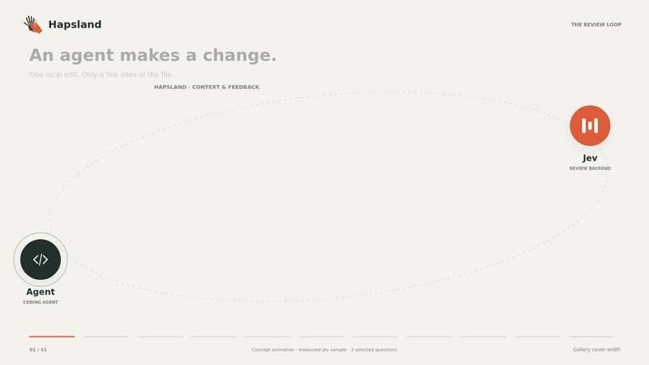

# Hapsland

<p align="center"></p>

Review changed types and functions with their related code.

Hapsland gives your coding agent early feedback on changed types and functions,
using their related code. Start with built-in checks or add rules for your team's
code-design concerns.

## Review the decisions behind an edit

A type can allow a state that makes no sense. A function can make an assumption
its inputs do not support. Those choices can spread as the agent writes more code.
Hapsland reviews supported edits while the agent is working, giving it a chance
to revisit the decision early.

Hapsland starts from the edited lines, finds the changed type or function, then
follows its references to build a tree of related definitions. Checks use that declaration and the related code they
need. This lets review consider relationships beyond the changed lines. A check
that lacks necessary code is skipped.

<p align="center"></p>

The animation starts with a small edit, expands to the declaration and related
code, then illustrates a feedback and repair loop. Feedback follows the edit; it does not
undo it or guarantee a repair. Delivery and optional blocking feedback depend on
the agent runtime and configuration. See the [architecture guide](./docs/architecture.md)
for the flow and its boundaries. Run `hapsland --feedback-preview` to see the
shared agent instructions with a synthetic finding; no review request is made.

## What can the checker see?

Sending source to a review service is a data-sharing decision. Your task prompt
and conversation with the agent are not sent to the review backend.

You choose which changed files can be reviewed and which files can supply related
code. Related code follows the review file scope unless you explicitly configure a
context scope. Privacy exclusions protect both kinds of reads and cannot be undone
by project includes. Limits bound exploration and the code included in the review tree.

Selected source code and rule questions are sent to the selected external
classifier: [Jev](https://typesafe.ai) by default, or Cloudflare Clef/Clef-flash. It sees that code and those questions, not the agent’s
task or conversation. Hapsland maps its results to configured feedback messages.
The checker receives one supported type declaration, or a TypeScript function's
signature and body, plus bounded related code reached through supported local
references. Required evidence missing from that graph can prevent a rule from
running. The review input excludes the full file, edit diff, agent conversation, and
unrelated source. With review credentials and no
file settings, all otherwise eligible files are selected. Set an explicit scope
when you want a narrower boundary. See [configuration](./docs/configuration.md).

## Choose a review backend

Jev is the default. To use Cloudflare, set `reviewBackend` in your user
configuration (project configuration cannot choose the backend):

```jsonc
{
  "version": 1,
  "reviewBackend": {
    "provider": "cloudflare",
    "model": "clef",
    "accountId": "0123456789abcdef0123456789abcdef"
  }
}
```

Use your Cloudflare account ID and make `CLOUDFLARE_API_TOKEN` available to the
installed runtime. The model can also be `clef-flash`; `hapsland --login` manages
Jev credentials. A shared limit catalog checks request bytes and question counts
where documented, including Clef's 64-question limit. Token limits are recorded
but require a tokenizer before they can be enforced. See
[provider configuration and limits](./docs/review-providers.md) for details.

Hapsland also manages review resources: each resident has separate pools for
eight preparation jobs and eight concurrent classifier request permits, plus
bounded retained state and advice output. See
[review resources and limits](./docs/review-resources.md) for saturation behavior,
configuration controls, and the distinction between collection and model limits.

## A formally checked core

The review request must fit the model’s context, including the rule questions.
Hapsland limits how much related code it collects. Formal proofs check that the
core keeps selected code within that configured size limit.
A checked access-refusal case issues no command to read the excluded file.*
Deterministic simulations exercise failures and recovery using that core;
native integration tests check separate filesystem, transport, and host boundaries.

\* In the checked exclusion case, the core issues no source-read command for
the denied dependency. This is a proof of that case, not a general proof of
absence of leaks across every execution. Source parsing, filesystem observations,
and network calls remain native code. See [proof scope and evidence](./docs/architecture.md#what-verification-establishes).

## Built-in rules and your own

With no explicit rule selection, authorized setup connects nine editable JSON rule
files with questions about code
design, including whether a declaration allows meaningless combinations of values.
Each rule declares supported languages, input forms, and required related code.

Inspect them with `hapsland rules list` or `hapsland rules show --id r1_inferred_case`.
Author one rule per file and connect it explicitly. Choose personal or project
settings for activation, languages, file scope, threshold, and feedback messages.
File paths belong to settings; the rule defines the concern and evidence it needs.
A configured rule runs only on supported inputs with sufficient evidence. See
[custom rules](./docs/configuration.md#declarative-rules) and the
[type-design rules](./TYPE-DESIGN-RULES.md).

See [supported languages and limits](#supported-languages) before setup.

## Write your first rule

Start with the **nine editable default rules**: run `hapsland rules list`, then
`hapsland rules show --id r1_inferred_case` to inspect one and its source file.
You may already have a rule for your concern. Setup connects defaults when no
explicit rule selection is configured; your current inventory shows what is
actually connected and enabled.

For a custom concern, follow the [first-rule walkthrough](./docs/configuration.md#write-your-first-rule):
create and connect a starter with `hapsland rules create`, edit its JSON in your
editor, then test examples that should trigger and stay clear with `rules check`.
You can also write a JSON file yourself and use `rules connect`. These are local
editable files; you do not need the Hapsland source checkout.

## Does my rule work?

Try a rule against a specific declaration without making an agent edit. This
example uses the custom rule created in the walkthrough; substitute an enabled ID
from `hapsland rules list` to check another rule:

```sh
hapsland rules check --path src/example.ts --line 12 --id delivery-requires-address
```

The line is one-based and selects its enclosing supported declaration. Hapsland
captures that declaration and bounded related code with the normal parser, scope,
privacy and evidence checks, then sends the eligible rule and code to your
configured external classifier. This is a real request and may incur charges.
Omit `--id` to check all eligible enabled rules. It uses normal key discovery and
starts neither a resident nor an agent session. Add `--json` to see the actual
source-bearing classifier input and probabilities. Exit 0 means evaluation
completed, including findings; exit 6 means skipped or unavailable, not a passing
check. Try both examples that should trigger and examples that should stay clear;
one result does not establish rule accuracy.

To inspect **ordinary agent reviews**, enable the debug recording setting by
merging `"sessionInspection": true` into the repository's `.hapsland.jsonc`,
make a new eligible edit through an installed integration, then run
`hapsland dashboard`. The dashboard lets you inspect captured declarations,
related context, classifier results, and feedback. Recording is off by default,
contains source, and is independent of analytics. Opening the dashboard does not
enable recording or backfill history. One-off `rules check` results are returned
in the terminal; they are not recorded in the resident journal. See
[rule checks](./docs/configuration.md#try-a-rule-on-a-file-and-line) and
[dashboard setup](./docs/status.md#opt-in-local-inspection).

## A contextual comparison with Abide

[Explore the studies, examples and evidence](./docs/review-studies.md).
Our larger-declaration comparison covers **six scenarios: four types and two
functions**, using **Codex CLI 0.155.1, model `gpt-6-luna`, reasoning `max`**.
Both reviewers used Jev and the same target design concerns; Abide 0.0.7 used an
active custom rubric. All conditions included equal diagnostic feedback reporting.

With **one larger defective input per scenario**, Hapsland sessions produced
**6/6 independently checked repairs**, versus **0/6 in Abide sessions**. Including
one compact input per scenario, the counts were **11/12 and 2/12**. Hapsland also
produced one false warning in 36 clean detection observations, versus zero for
Abide. Each native cell was one session.

The overview links readable scenario pages, starting and final code, methodology
and detailed checks. Gaps also appeared on compact inputs; these results do not
establish that size caused the difference or general review superiority.

## Installation

Ask your coding agent to install it:

> Install Hapsland for my coding agent using https://github.com/dearlordylord/hapsland/blob/master/docs/installation-workflows.md. Let me review and approve the setup changes interactively. Ask me to enter any Jev key in the masked setup prompt, not in chat.

Or install manually after a stable release is published and verified:

1. Install Hapsland:

   ```sh
   npm install -g --ignore-scripts @hapsland/hapsland
   ```

2. In the Git repository you want reviewed, run:

   ```sh
   hapsland setup
   ```

   Select Claude Code, Codex CLI, or both with the checkboxes (arrows to move,
   Space to toggle, Enter to continue). Installed clients are checked and labeled.
   Unchecking a client leaves its installation intact. To skip the selector, use
   `hapsland setup claude` or `hapsland setup codex`.

   Setup previews owned hooks, asks before applying them, accepts a missing Jev key
   through masked input, shows the selected key source and replacement instructions,
   and reports offline readiness. You can then approve one optional Jev key check
   using a built-in greeting; it sends no project code and may use paid credits.

3. Finish current client work, restart the client normally, complete its native
   trust prompts, and make a supported edit. Follow the [status guide](./docs/status.md) to inspect observed review activity;
   installation alone does not establish that a review ran.

The hooks apply across the selected user profile, not just the repository where
you ran setup. Set [file selection](./docs/configuration.md) before reviewing
private code. Installation and setup do not send code to Jev.

The npm command uses your configured global prefix and assumes its `bin`
directory is on PATH. If installation fails on permissions or the command is
missing, use the [user-owned prefix alternative](./docs/installation-workflows.md#user-owned-prefix-alternative).
The package includes its Bun runtime in the standalone executables.

Public registry availability is not established by this guide. See the
[installation lanes](./docs/installation-workflows.md#stable-installation-and-ordinary-use)
for current distribution and host evidence.

Update installed integrations with `hapsland update`; add `claude` or `codex`
to select one client. The command previews hook changes and asks before applying
them. Use `--channel=next` for a published candidate.

If review is not working, start with `hapsland doctor`: it diagnoses registered
clients without changing files. See [installation workflows](./docs/installation-workflows.md)
for local builds, updates, recovery, and removal, or the
[Claude](./docs/claude-installation.md) and [Codex](./docs/codex-installation.md)
guides for exact host limits and automation.

<!-- configuration-readme:start -->

## Configuration

Configure file selection and exclusions, individual local rules and per-rule selection, and the credential environment-variable reference. The product accepts layered JSONC files. With no file settings, all otherwise eligible files are selected; user exclusions can turn review off.

A small project configuration:

```jsonc
{
  "version": 1,
  "includes": [
    "src/**"
  ]
}
```

See the [complete configuration guide](./docs/configuration.md) for field details, rules, precedence, and runtime behavior.

<!-- configuration-readme:end -->

## Supported languages

| Language | Reviewed code | Main limits |
| --- | --- | --- |
| TypeScript (`.ts`, `.tsx`, `.mts`, `.cts`) | Interfaces, type aliases, and named functions, with related local types and imports, within configured limits | Unsupported syntax or unresolved evidence can prevent review. |
| Rust (`.rs`) | Top-level structs, enums, and type aliases, with local type context across verified Cargo modules | Explicit local `mod`/`use` bindings and aliases are supported. External crates, re-exports, inline modules, functions, macros, and conditional compilation are not supported. Cargo metadata and supporting files must pass file selection. Attributes such as `derive` make evidence incomplete for the default rules. |
| Bend (`.bend`) | Top-level `type` datatypes and constructor payloads, with related definitions from the same file or explicit relative `.bend` alias imports, within configured limits | Functions, laws/proofs, dependent or computed types, and hub, bare, or absolute imports are unsupported. This first profile skips files with string literals and requires single-line constructors indented with two spaces. |

Rust cross-file context requires a selected `Cargo.toml` with an explicit
2018, 2021, or 2024 edition and supported library/binary targets. Workspace-inherited
editions, custom build targets, and test/example/bench target tables are outside
this profile. Module paths must be unambiguous; excluded supporting files stay unread.

Language support applies to source review; it does not select an agent runtime.
If an edit lacks the evidence a rule needs, Hapsland skips that rule. Silence
is not confirmation that the code passed review. See the
[review contract](./docs/type-function-review-proposal.md#branch-contracts) for
the exact supported syntax and [session status](./docs/status.md) to inspect
review activity.

## Development

See the [comparison with Abide](./docs/abide-comparison.md)
for the main architectural differences and the rationale for a separate product.

Use the [repository map](./docs/agents/navigation.md) to locate contracts,
implementation entry points, tests, the website, and research assets.

For the inspection dashboard, choose the page source explicitly:

| Use | Command | Page |
| --- | --- | --- |
| Development | `npm run dev:inspection` | Current checkout; page edits reload the browser automatically |
| Bundled production | `hapsland dashboard` | Page embedded in the installed package |

Both read the same local inspection journal. Page development needs no package
build or installation update. See [inspection development](./docs/status.md#opt-in-local-inspection)
for the source owner, port selection, and checks.

<!-- inspection-recording:start -->

Recording is off by default: merge `"sessionInspection": true` into your project's `.hapsland.jsonc` using the [configuration template](./docs/examples/session-inspection.jsonc), then make a new eligible edit. Neither dashboard enables recording or backfills old edits; retained history can remain visible after recording is turned off.

<!-- inspection-recording:end -->

Install a fresh local snapshot on your own client without publishing:

```sh
mise install bun@1.3.14
mise exec bun@1.3.14 -- npm run dev-install -- --host=claude
mise exec bun@1.3.14 -- npm run dev-install -- --host=codex
# Rerun the same command after source changes; --update optionally selects the update flow.
```

For installing a freshly packed snapshot into your own Claude Code or Codex profile,
see [installation and development workflows](./docs/installation-workflows.md#personal-development-on-your-own-clients).

This installs a fixed snapshot; source edits require rebuilding and updating it.
The script handles building, packing and activation; no manual archive handling
or publication is needed. See [repeated installation](./docs/installation-workflows.md#source-changes-and-repeated-installation).


```sh
npx --yes bun@1.3.14 install
npm run config:generate
npm run config:check
npm run typecheck
npm test
npm run conformance:package
```

`npm pack` builds standalone executables containing Hapsland and pinned Bun 1.3.14
for the CLI, parser, resident, and package doctor. Agent-loaded Pi extension JavaScript
remains a separate integration asset. The declared build targets are Linux arm64 and
macOS arm64; cross-compilation alone does not establish execution compatibility.
The [installed compatibility record](./docs/installed-release-compatibility.md)
distinguishes current validation from earlier Node-based observations.

Public commands use the package's executables and physical native assets. They do not
require Node or Bun on PATH and do not acquire packages per edit. Run `hapsland-doctor`
after installation for source-free compatibility checks. Source development and package
assembly still require the pinned development toolchain; installing the tarball with
scripts disabled does not compile native code.

The packaged CLI's preview/install/enable/disable/uninstall contract, ownership rules, recovery
behavior, and native trust handoff are documented in
[`docs/codex-installation.md`](./docs/codex-installation.md).
For publishing stable and `next` releases, use the
[publishing runbook](./docs/npm-publishing.md). The public command is
`hapsland`. The product is Hapsland and Jev is the external backend. The
[local release preflight](./evidence/release/npm-0.1.0-preflight.md) is not a registry release record.
After setup completes, the [installation guide](./docs/codex-installation.md) also documents the separate `hapsland --demo` preview and
live-confirmation flow. Its default preview is offline; a live run requires an exact
selection digest for a generated disposable repository and has explicit request,
source, and time limits.

`npm run conformance:package` packs into an isolated temporary prefix, installs with production
dependencies only, and runs the parser and controlled offline review outside the checkout. Add
`-- --real-codex --write-evidence` only for the declared real-host acceptance fixture; it uses
an isolated Codex home and temporary Git repository, does not change the user's host, removes
provider credentials, and retains only sanitized package/host outcomes.

`npm run conformance:installed-release` verifies the assembled installed-product evidence and
replays the complete offline lifecycle in isolated homes. Its declared compatibility cells include
a supervised synthetic first review through real Jev on Linux arm64; that test used normal native
hook trust and a labeled host sandbox bypass in this container. Exact versions, checksums,
setup-effort evidence, and the rule that untested cells remain
gaps are published in
[`docs/installed-release-compatibility.md`](./docs/installed-release-compatibility.md). The command
does not call Jev or perform an authenticated Codex retry.
The local single-repository opt-in pilot is scoped in
[`docs/codex-opt-in-pilot.md`](./evidence/codex-pilot/README.md).

Review dispatch uses effective file settings. With no file settings, every otherwise
eligible file is selected. User `excludes` accumulate with project exclusions and
`["**/*"]` turns review off even when a project supplies includes. Protected paths,
Git ignore rules, and invalid configuration still stop the relevant work.

```sh
printf '%s\n' '{"version":1,"operation":"credentials","cwd":"/absolute/repo"}' \\
  | node src/cli.ts --inspect-credentials
```

`--inspect-credentials` reports only the configured environment-variable name and
whether the resolved source is present. On Linux and macOS, `hapsland --login` uses masked
terminal input with the platform's native credential store;
`hapsland --login --credential-stdin` is the explicit headless form, and
`hapsland --logout` removes the owned saved item. Project configuration refers to a
credential environment-variable name; secret values are never stored in review
configuration or printed. User configuration selects Jev or Cloudflare Clef/Clef-flash; see
[provider selection and limits](docs/review-providers.md). Arbitrary endpoint routing is not supported. Hooks do not prompt.
An unavailable credential prevents provider dispatch. Changing effective exclusions
affects future dispatches and cannot recall a request already sent.

The supported Codex event boundary is documented in the
[direct-event profile](./docs/direct-event-v1-supported-profile.md). The installed Codex
integration uses a synchronous pre-edit permit and its matching composed post-edit hook.
An isolated `--codex-hook` call without that lifecycle stays quiet. The installed
hooks invoke the packed standalone CLI and never depend on this source path.
Setup and hooks read the selected key from environment → project `.env.local` →
project `.env` → user `~/.config/hapsland/.env` (or `$XDG_CONFIG_HOME/hapsland/.env`).
An explicit environment value takes priority, including empty. The default key reference
then falls back to native saved login. File keys need no special agent launcher;
[credential lookup](docs/installation-workflows.md#personal-development-on-your-own-clients)
describes file limits and diagnostics.

Live use selects `TYPESAFE_API_KEY` for Jev or `CLOUDFLARE_API_TOKEN` for Cloudflare
through the Effect provider configuration. Run the live integration checks only with explicit
opt-in via `npm run test:live`.
The initial direct-event capture profile is Linux-only. It binds the adapted working-tree
device/inode to an open directory descriptor and traverses through `/proc/self/fd`; hosts
without that facility are unsupported rather than falling back to path-only source reads.

Offline readiness diagnosis and headless activity inspection are documented in
[`docs/status.md`](./docs/status.md). Doctor checks the selected installed integration
without prompts, repairs, source reads, or Jev calls. Status uses an explicit host session
ID and bounded source-free resident activity, and never treats silence or missing
instrumentation as a clear review. Optional [session analytics](./docs/status.md#optional-session-analytics)
are disabled by default; user configuration can enable Jev outcome totals and recent
rule-ID history. See the [shared activity storage limits](./docs/status.md).

The maintainer-only semantic evaluation protocol and its sanitized offline milestone
evidence are documented in [`docs/evaluation.md`](./docs/evaluation.md) and
[`evidence/evaluation/README.md`](./evidence/evaluation/README.md). Ordinary tests and
the review hook never run the maintainer evaluation suite against Jev.

## Code style

Run `npm run format` to apply Oxlint fixes and dprint/OXC formatting.
`npm run lint:code` checks all authored code; `npm run lint:changed` checks staged,
unstaged and untracked code against `HEAD`. For a branch comparison, use
`npm run lint:changed -- --base=origin/master`. `check:fast` includes changed-file
checks, and CI checks all authored code.

`npm run prepare` installs the Husky Git hook (also run during dependency
installation). Pre-commit runs lint-staged: it fixes and restages selected code,
and rejects remaining lint errors. Generated, vendor, fixture and evidence files
are excluded. [The formatter configuration](./dprint.json) and
[lint rules](./.oxlintrc.json) own the exact settings. The imported Dalph setup uses
two-space indentation and 120-column formatting. Hapsland keeps Effect generators
without `yield` and inline import types; namespace type resolution is checked by
TypeScript because Oxlint's import namespace check reports false positives for Effect.

<!-- hapsland-hooks:start -->
## Agent hooks

Generated from [the hook catalog](./src/runtime/hook-catalog.ts). Command timeouts are upper limits, not measured latency. Pi limits each Hapsland command call; a callback may make multiple calls. Codex does not install a `UserPromptSubmit` hook. OpenCode review hooks are currently inactive.

| Runtime | Event | Selection | Mode | Limit | Purpose |
| --- | --- | --- | --- | --- | --- |
| Codex CLI | `PreToolUse` | `^(apply_patch\|Edit\|Write\|Bash)$` | Sync command | 5 s | Register an edit attempt before the tool runs |
| Codex CLI | `PostToolUse` | `^(apply_patch\|Edit\|Write\|Bash)$` | Sync command | 10 s | Report the edit and collect ready advice |
| Codex CLI | `PostToolUse` | `^(apply_patch\|Edit\|Write\|Bash)$` | Async command | 25 s | Deliver advice that finishes after the edit response |
| Codex CLI | `Stop` | All | Sync command | 5 s | Collect admitted review results before the agent finishes |
| Codex CLI | `SubagentStop` | All | Sync command | 5 s | Collect admitted review results before a subagent finishes |
| Claude Code | `PreToolUse` | `Edit\|Write` | Sync command | 5 s | Register an edit attempt before the tool runs |
| Claude Code | `PostToolUse` | `Edit\|Write` | Sync command | 5 s | Report the edit and collect ready advice |
| Claude Code | `Stop` | All | Sync command | 5 s | Collect admitted review results before the agent finishes |
| Claude Code | `SubagentStop` | All | Sync command | 5 s | Collect admitted review results before a subagent finishes |
| Claude Code | `UserPromptSubmit` | All | Sync command | 4 s | Notify the resident of the user prompt; does not open a review round |
| Pi | `agent_start` | All | Extension callback | No IPC | Remember the agent identity for cleanup |
| Pi | `tool_call` | `edit` | Extension callback | 7 s per IPC call | Register a supported edit attempt |
| Pi | `tool_result` | `edit` | Extension callback | 7 s per IPC call | Report the edit and offer ready advice in the tool result |
| Pi | `agent_before_settle` | All | Extension callback | 7 s per IPC call | Offer review advice before the agent settles |
| Pi | `session_before_switch` | All | Extension callback | 7 s per IPC call | Retire edit attempts and close owned partitions |
| Pi | `session_shutdown` | All | Extension callback | 7 s per IPC call | Retire edit attempts and close owned partitions |
| Pi | `agent_settled` | All | Extension callback | 7 s per IPC call | Close the originating agent partition |
<!-- hapsland-hooks:end -->
