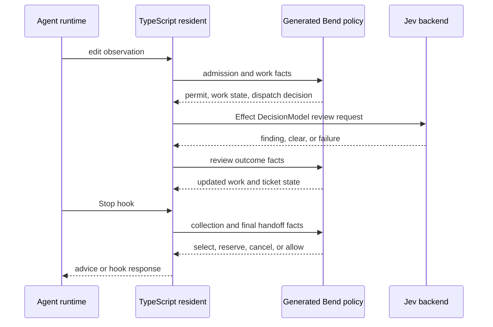
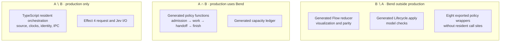

# What runs Hapsland's production flow?

**Bend supplies the production decision policy. TypeScript runs the production
workflow.** The resident owns the event loop, native state, and effects. It
calls generated Bend JavaScript in process at decision boundaries and applies
the returned decision and policy state. There is no separate Bend service or
single production `Flow.bend` reducer.

## 1. Where production touches Bend

This is one representative edit-to-Stop-response path. Each Bend call is
synchronous generated JavaScript; Jev review is a separate Effect 4 operation.

The resident also captures source, measures exact identity, time, and encoded
bytes, keeps native maps, manages IPC, and formats output. Bend source is
compiled into generated JavaScript; the app build verifies and packages those
artifacts.

Source anchors: [resident Stop dispatch](../src/resident/server.ts#L2484),
[Bend Round call](../src/resident/composed-delivery.ts#L294),
[Bend Lifecycle finish gate](../src/resident/bend-work.ts#L130),
[capacity ledger](../src/resident/capacity.ts#L67),
[Effect Jev path](../src/jev-decision.ts#L57),
[Bend policy compiler](../packages/agent-flow-bend/scripts/build-policy.mjs).

## 2. Which code paths overlap?

Let **A** be the resident implementation and the callable paths it references,
and **B** be Bend-authored executable paths. This is a static reference map,
not a claim that every branch executes at runtime. The three regions below
partition `A ∪ B`.
The outside regions form the **symmetric difference**:
`A △ B = (A ∖ B) ∪ (B ∖ A)`. A and B are **not disjoint**, because their
intersection contains the policy and ledger functions called in production.

The TypeScript sidecar `flow.ts` is outside both sets. The visualization
compares it with `Flow.bend` on their **shared simplified scenario**, not
with the complete production lifecycle. The [visualization audit](bend-visualization-audit.md)
names the eight wrappers and the comparison checks.

The original [extension plan](../packages/agent-flow-bend/EXTENSION-PLAN.md)
described a single Bend reducer instance as a target. The implemented
[completion report](bend-full-flow-completion-report.md) records the actual
composition: generated Bend gates alongside retained TypeScript state.
