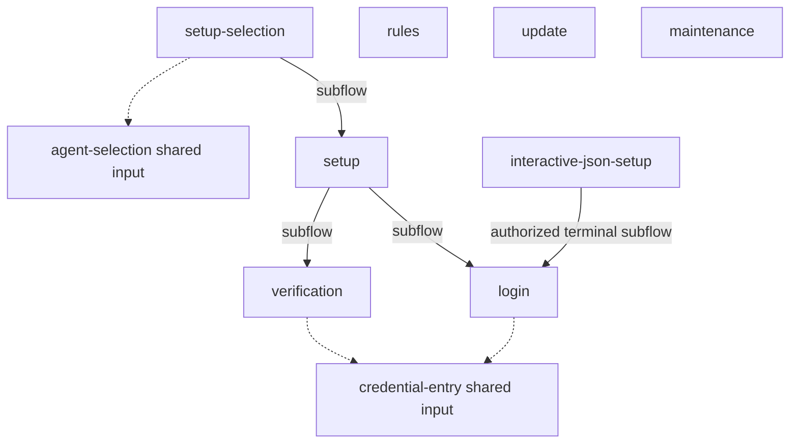

# CLI interaction surfaces and acceptance

**Purpose:** Inventory every registered administration terminal flow, shared input fragment, deliberate direct-command exception and its generated documentation.
**Status:** Maintained flow documentation and inventory.
**Authority:** Maintained implementation documentation. [#244](https://github.com/dearlordylord/hapsland/issues/244) and the linked domain contracts own required behavior; test results establish only their executed scope.
**Expected use:** Locate workflow diagrams and prompt owners; use the source preflight and replay freshness checks before accepting UI changes.
**Lifecycle:** Update when a CLI input surface, owner or generated diagram changes. Review when accepted interaction behavior changes or another interactive command is added.

The [architecture decision](../adr/0004-administration-cli-interactions.md) defines ownership, consent and Effect lifetime. Installation and credential behavior remain governed by [installation workflows](../installation-workflows.md). The [testing matrix](../testing-matrix.md) determines required checks.

`node scripts/check-ui-flows.mjs` checks source registration without building dependencies. The supported TypeScript compiler and workspace-build entries run it before compiling. The product build runs every registered replay and rejects stale Markdown before assembling a release. [Flow-contract tests](../../scripts/check-ui-flows.test.mjs) exercise missing registrations, diagrams and generators against the real compiler/replay entries; [production replay checks](../../src/onboarding/ui-flow-diagrams.test.ts) run every registered interpreter.

The closed registry governs each prompt owner’s permitted input kinds, shared fragments, child-flow connections and replay generator. Production input uses `flowInteraction`; child effects use typed `childFlow` dispatch. Source preflight rejects unregistered input, undeclared child entries or fragments, missing production dispatches, diagrams and replay mappings. Raw input capabilities are restricted to the fixed transport and composition boundaries. These checks enforce workflow registration and generated-document freshness; finite replay scenarios do not establish exhaustive transition coverage.

<!-- ui-flow-inventory:start -->

This inventory and connection graph derive from the closed [production registry](../../packages/administration/src/interaction/flow-registry.ts). Connections declare interpreter composition; workflow diagrams below show user-visible choices and outcomes from production transitions. Neither graph establishes exhaustive transition coverage or physical terminal support.

| Workflow | Production entry | Registered prompt kinds | Generated documentation |
| --- | --- | --- | --- |
| setup-selection | [runSetupSelection](../../packages/administration/src/onboarding/setup-selection.ts) | chooseMany | [Flow diagram](setup-selection.md) |
| setup | [runPilotSetup](../../packages/administration/src/onboarding/pilot.ts) | confirm | [Flow diagram](setup.md) |
| login | [runLoginConversation](../../packages/administration/src/credentials/login-conversation.ts) | choose, confirm | [Flow diagram](login.md) |
| verification | [runVerificationConversation](../../packages/administration/src/onboarding/verification-conversation.ts) | choose, confirm | [Flow diagram](verification.md) |
| rules | [runRuleConversation](../../packages/administration/src/rules/conversation.ts) | choose, confirm | [Flow diagram](rules.md) |
| update | [updateClients](../../packages/administration/src/onboarding/update.ts) | choose, confirm | [Flow diagram](update.md) |
| maintenance | [maintainClients](../../packages/administration/src/onboarding/maintenance.ts) | choose, confirm | [Flow diagram](maintenance.md) |

Shared input fragments belong to registered parent workflows; they cannot introduce a standalone conversation without their own workflow registration and replay generator.

| Shared fragment | Production entry | Parent diagrams |
| --- | --- | --- |
| credential-entry | [captureCredential](../../packages/administration/src/credentials/masked-input.ts) | [login](login.md), [verification](verification.md) |
| agent-selection | [selectSetupClients](../../packages/administration/src/onboarding/client-selection.ts) | [setup-selection](setup-selection.md) |

Direct input/output exceptions have no invented dialog states. Any human prompt they add must use a registered workflow; interactive JSON setup delegates to login explicitly.

| Direct exception | Production entry | Reason and boundary |
| --- | --- | --- |
| interactive-json-setup | [runJsonSetup](../../packages/cli-entry/src/cli.ts) | JSON stays on stdin; explicitly authorized input uses the registered login flow on the controlling terminal. |
| credential-stdin | [runDirectCredentialInput](../../packages/administration/src/credentials/direct-input.ts) | Explicit direct native-save automation; no dialog. |
| logout | [logoutSavedCredential](../../packages/cli-entry/src/cli.ts) | Direct native deletion; no dialog. |
| inspection | [runOperation](../../packages/cli-entry/src/cli.ts) | Doctor, rules inspection and dashboard report observations without input dialogs. |
| unattended-setup | [runUnattendedSetup](../../packages/administration/src/onboarding/unattended.ts) | Version-one preview/apply authorization is supplied as structured input; no implicit terminal consent. |

<!-- ui-flow-inventory:end -->

## Documentation scope

These diagrams describe user-visible navigation, consent and outcomes. Executable generators and focused tests retain the scripted scenarios and assertions; revision counters and command identities are internal test evidence and are not published here.

The diagrams are generated from bounded production replays. They do not establish exhaustive transition coverage, physical terminal readability or installed-platform support. See the [testing matrix](../testing-matrix.md), [installed compatibility contract](../installed-release-compatibility.md) and [interaction architecture](../adr/0004-administration-cli-interactions.md) for those boundaries. Historical #244 acceptance and validation records remain in Git and the issue tracker.

`npm run interaction:diagrams:write` regenerates the flow documents and inventory. `npm run interaction:diagrams:check` checks freshness without writing.
