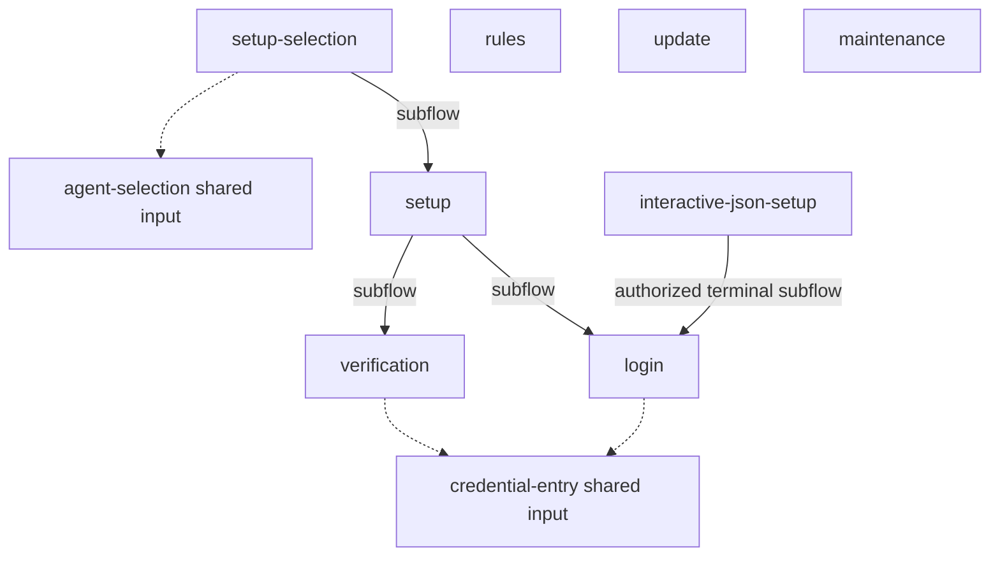

# CLI interaction surfaces and acceptance

**Purpose:** Inventory every registered administration terminal flow, shared input fragment, deliberate direct-command exception and its generated documentation.
**Status:** Production integration and prototype consolidation completed; observed validation limits remain explicit below.
**Authority:** Maintained implementation and validation inventory. [#244](https://github.com/dearlordylord/hapsland/issues/244) and the linked domain contracts own required behavior; test results establish only their executed scope.
**Expected use:** Locate workflow diagrams and prompt owners; use the source preflight and replay freshness checks before accepting UI changes.
**Lifecycle:** Update when a CLI input surface, owner, scenario or validation result changes. Review all rows before closing #244 and when adding another interactive command.

The [architecture decision](../adr/0004-administration-cli-interactions.md) defines ownership, consent and Effect lifetime. Installation and credential behavior remain governed by [installation workflows](../installation-workflows.md). The [testing matrix](../testing-matrix.md) determines required checks.

`node scripts/check-ui-flows.mjs` checks source registration without building dependencies. The supported TypeScript compiler and workspace-build entries run it before compiling. The product build runs every registered replay and rejects stale Markdown before assembling a release. The [architecture decision](../adr/0004-administration-cli-interactions.md) records the enforcement boundary. [Flow-contract tests](../../scripts/check-ui-flows.test.mjs) exercise missing registrations, diagrams and generators against the real compiler/replay entries; [production replay checks](../../src/onboarding/ui-flow-diagrams.test.ts) run every registered interpreter.

<!-- ui-flow-inventory:start -->

This inventory and connection graph derive from the closed [production registry](../../packages/administration/src/interaction/flow-registry.ts). Connections declare interpreter composition; workflow diagrams below derive from actual named replays. Neither graph establishes exhaustive transition coverage or physical terminal support.

| Workflow | Production entry | Registered prompt kinds | Generated documentation |
| --- | --- | --- | --- |
| setup-selection | [runSetupSelection](../../packages/administration/src/onboarding/setup-selection.ts) | chooseMany | [Replay diagram](setup-selection.md) |
| setup | [runPilotSetup](../../packages/administration/src/onboarding/pilot.ts) | confirm | [Replay diagram](setup.md) |
| login | [runLoginConversation](../../packages/administration/src/credentials/login-conversation.ts) | choose, confirm | [Replay diagram](login.md) |
| verification | [runVerificationConversation](../../packages/administration/src/onboarding/verification-conversation.ts) | choose, confirm | [Replay diagram](verification.md) |
| rules | [runRuleConversation](../../packages/administration/src/rules/conversation.ts) | choose, confirm | [Replay diagram](rules.md) |
| update | [updateClients](../../packages/administration/src/onboarding/update.ts) | choose, confirm | [Replay diagram](update.md) |
| maintenance | [maintainClients](../../packages/administration/src/onboarding/maintenance.ts) | choose, confirm | [Replay diagram](maintenance.md) |

Shared input fragments belong to registered parent workflows; they cannot introduce a standalone conversation without their own workflow registration and replay generator.

| Shared fragment | Production entry | Parent diagrams |
| --- | --- | --- |
| credential-entry | [captureCredential](../../packages/administration/src/credentials/masked-input.ts) | [login](login.md), [verification](verification.md) |
| agent-selection | [selectSetupClients](../../packages/administration/src/onboarding/client-selection.ts) | [setup-selection](setup-selection.md) |

Direct input/output exceptions have no invented dialog states. Any human prompt they add must use a registered workflow; interactive JSON setup delegates to login explicitly.

| Direct exception | Production entry | Reason and boundary |
| --- | --- | --- |
| interactive-json-setup | [runJsonSetup](../../packages/cli-entry/src/cli.ts) | JSON stays on stdin; explicitly authorized input uses the registered login flow on the controlling terminal. |
| credential-stdin | [runDirectCredentialInput](../../packages/administration/src/credentials/direct-input.ts) | Explicit direct native-save automation; no dialog. |
| logout | [logoutSavedCredential](../../packages/cli-entry/src/cli.ts) | Direct native deletion; no dialog. |
| inspection | [runOperation](../../packages/cli-entry/src/cli.ts) | Doctor, rules inspection and dashboard report observations without input dialogs. |
| unattended-setup | [runUnattendedSetup](../../packages/administration/src/onboarding/unattended.ts) | Version-one preview/apply authorization is supplied as structured input; no implicit terminal consent. |

<!-- ui-flow-inventory:end -->

## Observed integration evidence

The 2026-10-07 integration candidate passed the following local checks. These results describe their executed boundaries; they do not declare full-project qualification or native coding-agent approval.

- macOS arm64: fast gate; 58 setup, verification/storage and interaction-terminal tests; 8 credential CLI/PTY tests.
- Linux arm64: the same 58 owner/terminal tests and 27 credential CLI/setup PTY tests, in an isolated container without a host workspace mount.
- Both platforms: all nine installed setup journeys, including controlling-terminal capture, hidden-input cancellation preserving the previous credential, terminal restoration and fixture-only activation. Provider calls were zero.
- Linux installed lifecycle: approval grouping, active-package routing, retained Claude/Codex hooks, repair/reinstall/uninstall and Pi conflict/idempotency cases. The source fallback assertion checks the selected pinned Bun, as required by the source command owner.
- The ordinary two-profile build passed with explicit `HAPSLAND_BUILD_BUN`, including publication and process cleanup. Assembly tasks now preserve that documented override; executable identity, cache inputs and inventory checks remain enforced.
- All four physical build campaigns completed their assertions and rollback/repair within 240 seconds: [interaction-only change](../../evidence/build-243/build-acceptance-1791410894842-21334.json), [incomplete cached interaction output](../../evidence/build-243/build-acceptance-1791411136201-24977.json), [shared implementation with unchanged declarations](../../evidence/build-243/build-acceptance-1791411282903-27493.json), and [changed dependency policy](../../evidence/build-243/build-acceptance-1791411548080-32002.json).
- Astra milestone review findings were repaired: deferred CLI flags are read after parsing, hidden-input cancellation preserves required activation, and later successful agents cannot erase an earlier failure. A follow-up review of the Bun propagation fix found no issues.
- All six interaction diagrams passed freshness checks. The full documentation gate passed on macOS with `TMPDIR=/private/tmp`; the default aliased temporary path still makes two existing architecture-generator CLI fixtures return without executing. This environment limitation remains separate from diagram freshness and local-link correctness.
- The provider instruction-limit predicate was extracted without changing violation priority or Unicode code-point counting. Its 32 focused provider/limit tests, TypeScript and fast gate passed; Astra found no semantic issues. The complexity preflight now reports no guaranteed threshold failures, which is not a coverage result.

The installed checks above used archive SHA-256 `916fc05605c9bf631a7178b104841d005652da77009f430180cec168ce7bec11`; packaging reproduced those bytes after the lifecycle assertion correction. After the provider-limit refactoring, ordinary two-profile archive preparation passed in 237.8 seconds and produced `0188b32a0aac2d589b0e9922e6df9027cc1da89d29befc55f2c652ab89fb08b8`. That newer archive has build and packaging evidence, but has not undergone installed execution. The earlier installed results must not be relabeled as execution of the newer bytes.

## Acceptance decision and limits

On 2026-10-07 the owner accepted the completed full-quality attempt plus focused validation of its diagnosed complexity failure for #244, and directed continuation without another full run. This closes the separate full-run condition for this integration; it does not establish fresh full-project coverage or a passing final CRAP analysis. Those stages did not execute. Repository quality thresholds, missing-evidence policy and future gate requirements are unchanged.

Adopted interaction decisions now live in the architecture decision, installation workflows and configuration guide. Production workflow tests and the closed registry’s replay generators own the retained behavior and diagrams. The #244 setup-interaction prototype and superseded proposal have been removed; Git history retains the experiments. Unrelated prototypes are outside this cleanup.

Visual readability remains an owner assessment, distinct from programmatic PTY acceptance. The archive identities and installed-execution limits above remain unchanged.

Each generated diagram names its scenarios and limits. `npm run interaction:diagrams:write` explicitly regenerates documentation; `npm run interaction:diagrams:check` is non-writing. These public commands follow the repository's maintained documentation-generation inventory.
