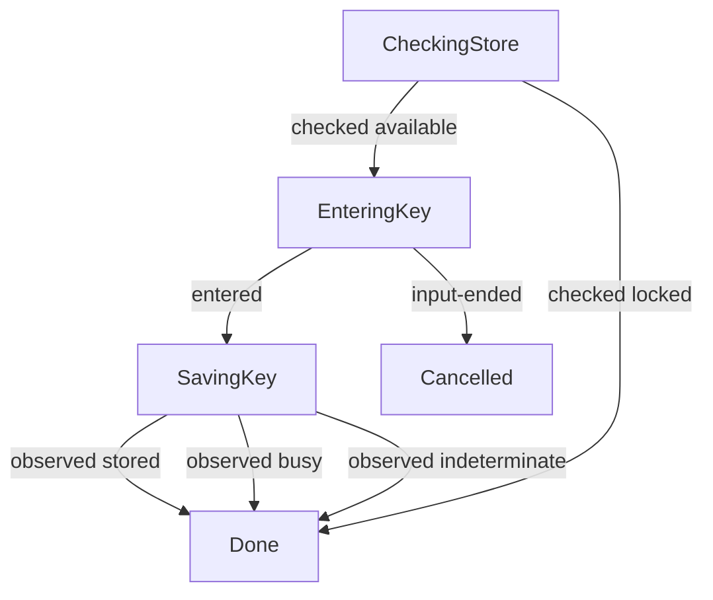

# Login interaction

**Purpose:** Show the production login conversation and correlation witnessed by its replays.
**Status:** Maintained generated diagram.
**Authority:** Implementation and controlled validation evidence for #244; accepted credential contracts and native owners retain product authority.
**Expected use:** Inspect availability, hidden cancellation and storage outcomes; run `npm run interaction:diagrams:check` to check freshness without writing.
**Lifecycle:** Regenerate with `npm run interaction:diagrams:write` whenever the production reducer, interpreter or replay cases change. Review when the accepted login interaction changes.

These replays run the production interpreter and secret-capture adapter with scripted input and controlled owners. They perform no native credential writes or provider requests and do not validate a physical terminal. Availability is checked before input. Hidden cancellation exits without saving. Busy and indeterminate remain observed owner outcomes; they are not represented as successful saves. The explicit `--credential-stdin` route supplies input directly to the same conversation without a terminal dialog.

## Replay correlation

The table records actual production transitions and command identities. Keys never enter models, events or this projection. Each replay independently asserts probe/save counts, consumed input and its expected outcome.

| Replay | Input revision | Event | Command identity | Output revision |
| --- | --- | --- | --- | --- |
| stored | 0 | checked available | 0 | 1 |
| stored | 1 | entered | 1 | 2 |
| stored | 2 | observed stored | 2 | 3 |
| cancelled | 0 | checked available | 0 | 1 |
| cancelled | 1 | input-ended | 1 | 2 |
| locked | 0 | checked locked | 0 | 1 |
| busy | 0 | checked available | 0 | 1 |
| busy | 1 | entered | 1 | 2 |
| busy | 2 | observed busy | 2 | 3 |
| indeterminate | 0 | checked available | 0 | 1 |
| indeterminate | 1 | entered | 1 | 2 |
| indeterminate | 2 | observed indeterminate | 2 | 3 |
