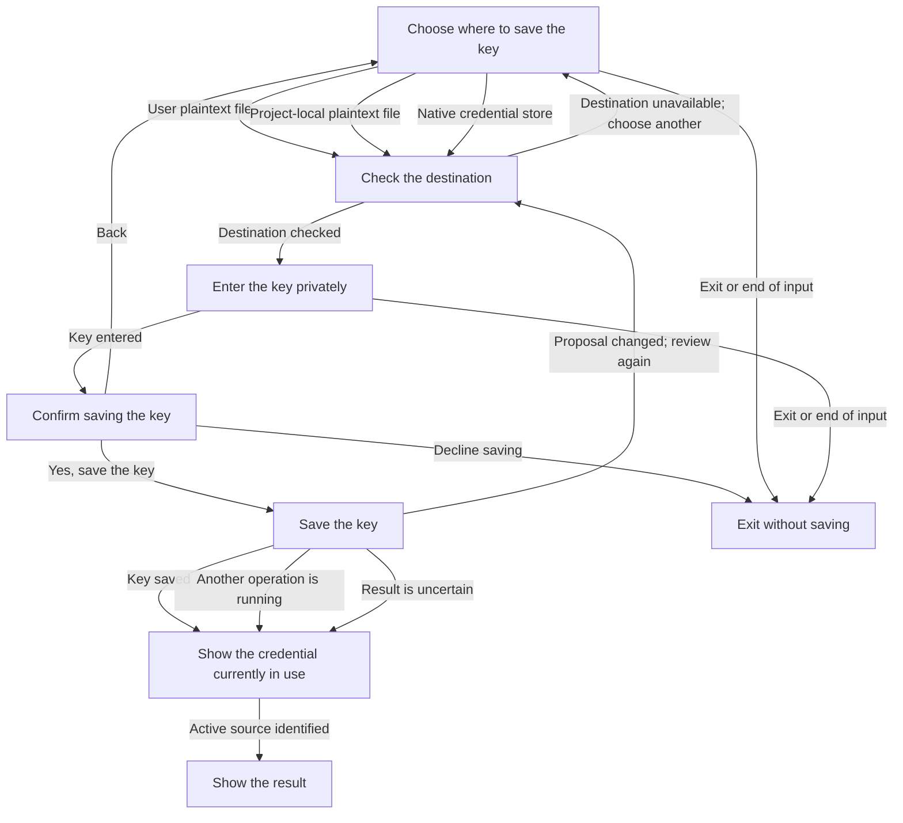

# Login interaction

**Purpose:** Show production credential destination selection and approved saving.
**Audience:** Contributors, including coding agents; Product and specification owners reviewing CLI journeys.
**Status:** Maintained generated diagram.
**Authority:** Implementation and controlled validation evidence for #248; the issue and accepted credential contracts own requirements.
**Expected use:** Understand destination selection, save approval and recovery and run `npm run interaction:diagrams:check` for freshness.
**Lifecycle:** Regenerate with production reducer, interpreter or diagram generation changes; review when credential consent changes.

Choose where to save your key, enter it privately, then confirm the save. Declining saves nothing; Back discards the entered key. If the destination changes, review and approve it again. A busy or uncertain save is reported separately from the credential currently in use. Saving does not override an environment credential. The explicit `--credential-stdin` command keeps its direct native-save automation path.

