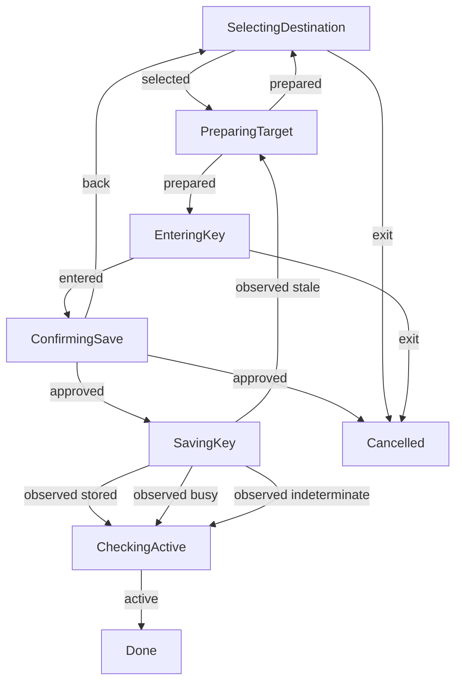

# Login interaction

**Purpose:** Show production credential destination selection and approved saving.
**Status:** Maintained generated diagram.
**Authority:** Implementation and controlled validation evidence for #248; the issue and accepted credential contracts own requirements.
**Expected use:** Inspect the named scenarios and run `npm run interaction:diagrams:check` for freshness.
**Lifecycle:** Regenerate with production reducer, interpreter or replay changes; review when credential consent changes.

These production interpreter/reducer replays use controlled owners and scripted interaction. They establish destination selection, separate decline-default confirmation, Back discarding input, blocked saving, stale reapproval, cancellation and observed storage outcomes. Storage and effective source remain separate: saving the user file here leaves the environment selected. Keys stay outside every trace. No native writes or provider requests occur; this does not establish physical terminal or platform support. The explicit `--credential-stdin` automation contract retains its direct native-save path without dialogs.

| Case | Before revision | Action | After revision |
| --- | --- | --- | --- |
| stored | 0 | selected | 1 |
| stored | 1 | prepared | 2 |
| stored | 2 | entered | 3 |
| stored | 3 | approved | 4 |
| stored | 4 | observed stored | 5 |
| stored | 5 | active | 6 |
| declined | 0 | selected | 1 |
| declined | 1 | prepared | 2 |
| declined | 2 | entered | 3 |
| declined | 3 | approved | 4 |
| back | 0 | selected | 1 |
| back | 1 | prepared | 2 |
| back | 2 | entered | 3 |
| back | 3 | back | 4 |
| back | 4 | exit | 5 |
| cancelled | 0 | selected | 1 |
| cancelled | 1 | prepared | 2 |
| cancelled | 2 | exit | 3 |
| blocked | 0 | selected | 1 |
| blocked | 1 | prepared | 2 |
| blocked | 2 | exit | 3 |
| stale | 0 | selected | 1 |
| stale | 1 | prepared | 2 |
| stale | 2 | entered | 3 |
| stale | 3 | approved | 4 |
| stale | 4 | observed stale | 5 |
| stale | 5 | prepared | 6 |
| stale | 6 | entered | 7 |
| stale | 7 | approved | 8 |
| stale | 8 | observed stored | 9 |
| stale | 9 | active | 10 |
| busy | 0 | selected | 1 |
| busy | 1 | prepared | 2 |
| busy | 2 | entered | 3 |
| busy | 3 | approved | 4 |
| busy | 4 | observed busy | 5 |
| busy | 5 | active | 6 |
| indeterminate | 0 | selected | 1 |
| indeterminate | 1 | prepared | 2 |
| indeterminate | 2 | entered | 3 |
| indeterminate | 3 | approved | 4 |
| indeterminate | 4 | observed indeterminate | 5 |
| indeterminate | 5 | active | 6 |
