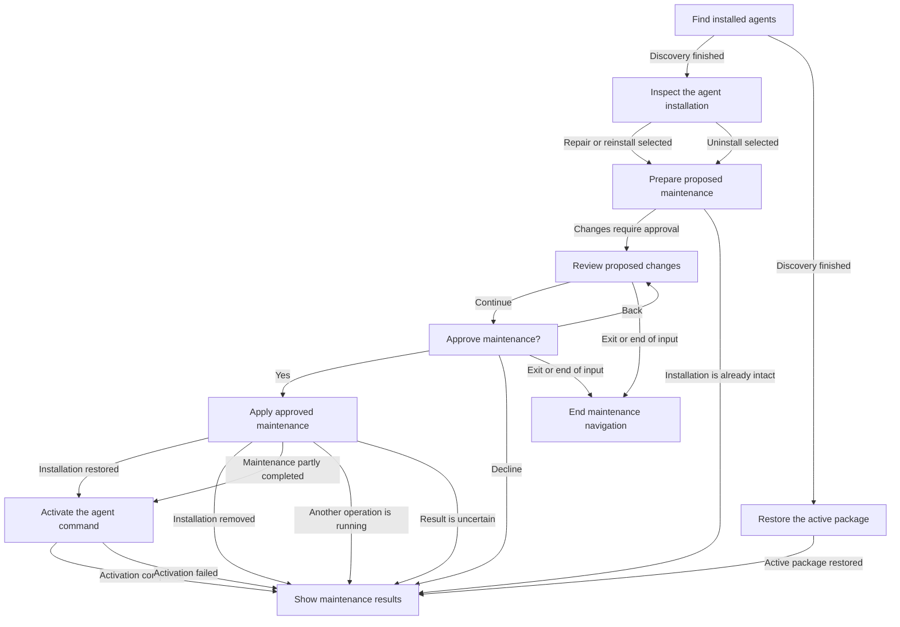

# Maintenance interaction

**Purpose:** Show production repair, reinstall and uninstall navigation and recovery.
**Status:** Maintained generated diagram.
**Authority:** Implementation and controlled validation evidence for #244; accepted installation contracts and lifecycle owners retain authority.
**Expected use:** Inspect per-agent consent and observed recovery results; use `npm run interaction:diagrams:check` for non-writing freshness.
**Lifecycle:** Regenerate with `npm run interaction:diagrams:write` when the reducer, interpreter or diagram generation changes; review when accepted maintenance behavior changes.

Review repair, reinstall or uninstall changes and confirm before applying them. Back returns to the review; Exit ends navigation. Repair resumes the inspected operation. Uninstall does not activate a package. Reinstall can restore the active package when no registrations exist. Partial, busy or uncertain results remain visible; activation failure does not undo a completed change.

