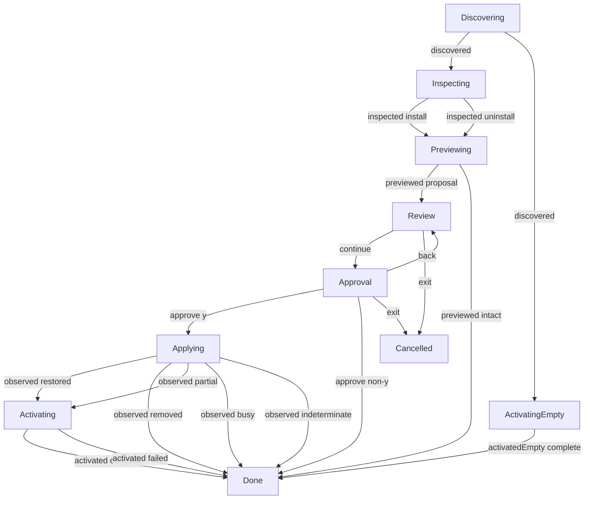

# Maintenance interaction

**Purpose:** Show production repair, reinstall and uninstall navigation and recovery.
**Status:** Maintained generated diagram.
**Authority:** Implementation and controlled validation evidence for #244; accepted installation contracts and lifecycle owners retain authority.
**Expected use:** Inspect per-agent consent and observed recovery results; use `npm run interaction:diagrams:check` for non-writing freshness.
**Lifecycle:** Regenerate with `npm run interaction:diagrams:write` when the reducer, interpreter or named scenarios change; review when accepted maintenance behavior changes.

Thirteen bounded replays run the production interpreter with scripted input and controlled owners. Independent assertions check operation selection, owner digest forwarding, consent, mutation and activation counts, input consumption and durable outcomes. They perform no real profile or credential writes and do not validate physical terminal or installed-platform behavior. Repair resumes the inspected operation; uninstall does not activate a package. Reinstall without registrations retains its existing active-package recovery. Escape at approval returns to Review; Exit and EOF end navigation. A failed activation cannot erase an observed mutation. Version-one installation JSON remains a direct automation exception.

## Replay correlation

Labels omit paths, credentials and full owner previews. Revisions and command identities correlate session events; owner digests authorize mutations. The graph contains accepted state changes. Focused workflow tests separately exercise stale/foreign consent rejection and preservation of earlier agents when later navigation exits.

| Replay | Input revision | Event | Command identity | Output revision |
| --- | --- | --- | --- | --- |
| repair | 0 | discovered | 0 | 1 |
| repair | 1 | inspected install | 1 | 2 |
| repair | 2 | previewed proposal | 2 | 3 |
| repair | 3 | continue | — | 4 |
| repair | 4 | approve y | — | 5 |
| repair | 5 | observed restored | 5 | 6 |
| repair | 6 | activated complete | 6 | 7 |
| reinstall | 0 | discovered | 0 | 1 |
| reinstall | 1 | inspected install | 1 | 2 |
| reinstall | 2 | previewed proposal | 2 | 3 |
| reinstall | 3 | continue | — | 4 |
| reinstall | 4 | approve y | — | 5 |
| reinstall | 5 | observed restored | 5 | 6 |
| reinstall | 6 | activated complete | 6 | 7 |
| uninstall | 0 | discovered | 0 | 1 |
| uninstall | 1 | inspected uninstall | 1 | 2 |
| uninstall | 2 | previewed proposal | 2 | 3 |
| uninstall | 3 | continue | — | 4 |
| uninstall | 4 | approve y | — | 5 |
| uninstall | 5 | observed removed | 5 | 6 |
| recover-uninstall | 0 | discovered | 0 | 1 |
| recover-uninstall | 1 | inspected uninstall | 1 | 2 |
| recover-uninstall | 2 | previewed proposal | 2 | 3 |
| recover-uninstall | 3 | continue | — | 4 |
| recover-uninstall | 4 | approve y | — | 5 |
| recover-uninstall | 5 | observed removed | 5 | 6 |
| decline | 0 | discovered | 0 | 1 |
| decline | 1 | inspected install | 1 | 2 |
| decline | 2 | previewed proposal | 2 | 3 |
| decline | 3 | continue | — | 4 |
| decline | 4 | approve non-y | — | 5 |
| back-exit | 0 | discovered | 0 | 1 |
| back-exit | 1 | inspected install | 1 | 2 |
| back-exit | 2 | previewed proposal | 2 | 3 |
| back-exit | 3 | continue | — | 4 |
| back-exit | 4 | back | — | 5 |
| back-exit | 5 | exit | — | 6 |
| eof | 0 | discovered | 0 | 1 |
| eof | 1 | inspected install | 1 | 2 |
| eof | 2 | previewed proposal | 2 | 3 |
| eof | 3 | continue | — | 4 |
| eof | 4 | exit | — | 5 |
| intact | 0 | discovered | 0 | 1 |
| intact | 1 | inspected install | 1 | 2 |
| intact | 2 | previewed intact | 2 | 3 |
| partial | 0 | discovered | 0 | 1 |
| partial | 1 | inspected install | 1 | 2 |
| partial | 2 | previewed proposal | 2 | 3 |
| partial | 3 | continue | — | 4 |
| partial | 4 | approve y | — | 5 |
| partial | 5 | observed partial | 5 | 6 |
| partial | 6 | activated complete | 6 | 7 |
| busy | 0 | discovered | 0 | 1 |
| busy | 1 | inspected install | 1 | 2 |
| busy | 2 | previewed proposal | 2 | 3 |
| busy | 3 | continue | — | 4 |
| busy | 4 | approve y | — | 5 |
| busy | 5 | observed busy | 5 | 6 |
| indeterminate | 0 | discovered | 0 | 1 |
| indeterminate | 1 | inspected install | 1 | 2 |
| indeterminate | 2 | previewed proposal | 2 | 3 |
| indeterminate | 3 | continue | — | 4 |
| indeterminate | 4 | approve y | — | 5 |
| indeterminate | 5 | observed indeterminate | 5 | 6 |
| activation-failed | 0 | discovered | 0 | 1 |
| activation-failed | 1 | inspected install | 1 | 2 |
| activation-failed | 2 | previewed proposal | 2 | 3 |
| activation-failed | 3 | continue | — | 4 |
| activation-failed | 4 | approve y | — | 5 |
| activation-failed | 5 | observed restored | 5 | 6 |
| activation-failed | 6 | activated failed | 6 | 7 |
| empty-reinstall | 0 | discovered | 0 | 1 |
| empty-reinstall | 1 | activatedEmpty complete | 1 | 2 |
