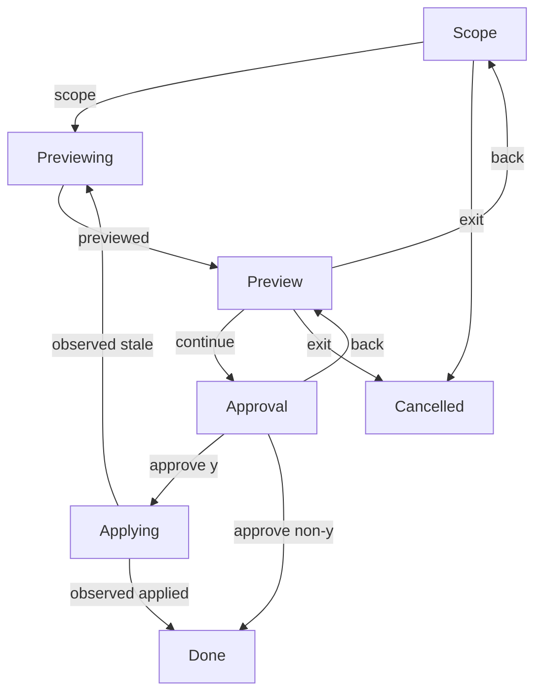

# Rules interaction

**Purpose:** Show the production rules conversation and the correlation witnessed by its replays.
**Status:** Maintained generated diagram.
**Authority:** Implementation and controlled validation evidence for #244; the accepted issue and rule owners retain product authority.
**Expected use:** Inspect navigation and approval boundaries; run `npm run interaction:diagrams:check` to check freshness without writing.
**Lifecycle:** Regenerate with `npm run interaction:diagrams:write` whenever the production reducer, interpreter or replay cases change. Review when the accepted rules interaction changes.

These replays run the production interpreter with scripted input and controlled owner outcomes. They do not write real rules or validate a native terminal. Owner digests authorize writes; revisions and command identities reject stale session events.

## Replay correlation

Command completions carry the revision of the command that issued them. The table records actual production transitions; it contains no credentials, rule content or user input text.

| Replay | Input revision | Event | Command identity | Output revision |
| --- | --- | --- | --- | --- |
| apply | 0 | scope | — | 1 |
| apply | 1 | previewed | 1 | 2 |
| apply | 2 | continue | — | 3 |
| apply | 3 | approve y | — | 4 |
| apply | 4 | observed applied | 4 | 5 |
| decline | 0 | scope | — | 1 |
| decline | 1 | previewed | 1 | 2 |
| decline | 2 | continue | — | 3 |
| decline | 3 | approve non-y | — | 4 |
| back | 0 | scope | — | 1 |
| back | 1 | previewed | 1 | 2 |
| back | 2 | continue | — | 3 |
| back | 3 | back | — | 4 |
| back | 4 | back | — | 5 |
| back | 5 | exit | — | 6 |
| eof | 0 | scope | — | 1 |
| eof | 1 | previewed | 1 | 2 |
| eof | 2 | exit | — | 3 |
| stale | 0 | scope | — | 1 |
| stale | 1 | previewed | 1 | 2 |
| stale | 2 | continue | — | 3 |
| stale | 3 | approve y | — | 4 |
| stale | 4 | observed stale | 4 | 5 |
| stale | 5 | previewed | 5 | 6 |
| stale | 6 | continue | — | 7 |
| stale | 7 | approve y | — | 8 |
| stale | 8 | observed applied | 8 | 9 |
