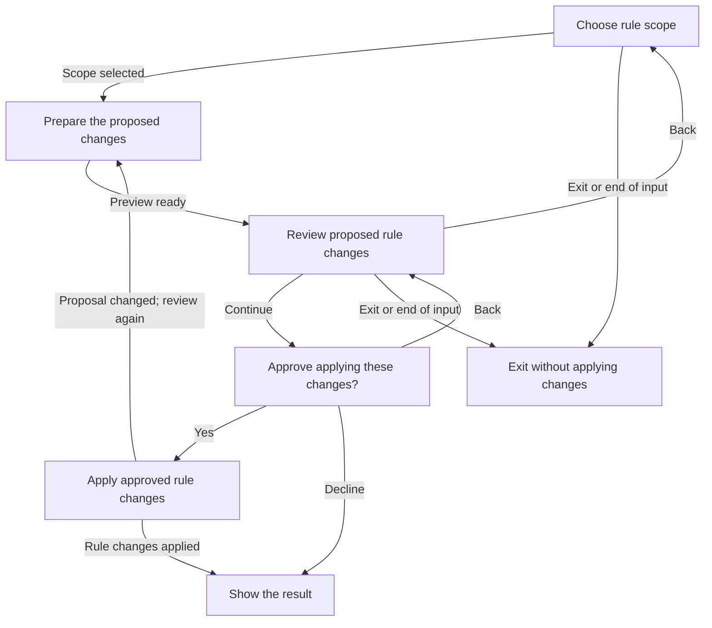

# Rules interaction

**Purpose:** Show rule selection, review, approval and outcomes.
**Status:** Maintained generated diagram.
**Authority:** Implementation and controlled validation evidence for #244; the accepted issue and rule owners retain product authority.
**Expected use:** Inspect navigation and approval boundaries; run `npm run interaction:diagrams:check` to check freshness without writing.
**Lifecycle:** Regenerate with `npm run interaction:diagrams:write` whenever the production reducer, interpreter or generated flow changes. Review when the accepted rules interaction changes.

Choose the rule scope, review the proposed changes, then confirm before applying them. Declining leaves rules unchanged. Back returns to the preview or scope choice; Exit ends the conversation. If the proposal changes, Hapsland shows a fresh preview and asks for approval again.

