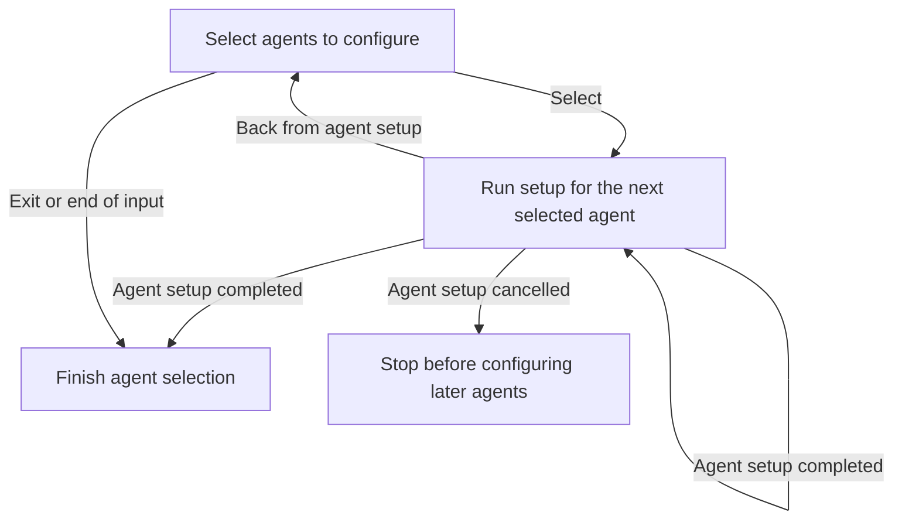

# Agent selection and setup navigation

**Purpose:** Show the production outer agent-selection loop and its per-agent handoff.
**Status:** Maintained generated diagram.
**Authority:** Implementation and implementation documentation; installation and interaction contracts own consent.
**Expected use:** Inspect multi-agent ordering, Back and cancellation before opening the linked setup subflow.
**Lifecycle:** Regenerate when the selection interpreter or generated flow changes; review when agent-navigation behavior changes.

Select the agents to configure. Hapsland runs their setup flows in order. Back returns to agent selection and retains the previous selection; cancelling an agent stops later agents. Exit or end of input finishes selection. Open [setup](setup.md) for each agent’s approval flow, and [login](login.md) or [verification](verification.md) for credential choices.

