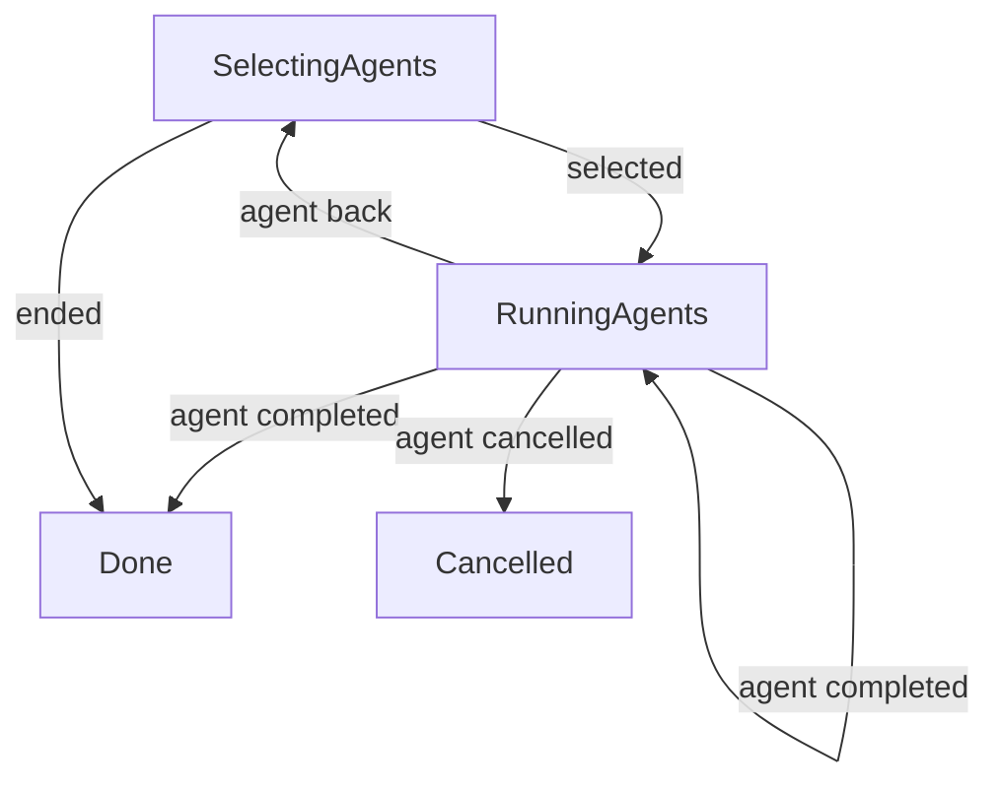

# Agent selection and setup navigation

**Purpose:** Show the production outer agent-selection loop and its per-agent handoff.
**Status:** Maintained generated diagram.
**Authority:** Implementation and controlled replay evidence; installation and interaction contracts own consent.
**Expected use:** Inspect multi-agent ordering, Back and cancellation before opening the linked setup subflow.
**Lifecycle:** Regenerate when the selection interpreter or replay cases change; review when agent-navigation behavior changes.

Six named replays execute the production selection interpreter and selector with scripted input. Controlled per-agent outcomes establish ordering, selection retention on Back, re-selection, Exit/EOF and cancellation stopping later agents. The per-agent callback delegates to [setup](setup.md); setup invokes [login](login.md) and [verification](verification.md). These are flow connections, not a claim that this replay exercises every child transition or a physical terminal.

| Case | Input revision | Event | Output revision |
| --- | --- | --- | --- |
| two-agents | 0 | selected | 1 |
| two-agents | 1 | agent completed | 2 |
| two-agents | 2 | agent completed | 3 |
| back-reselect | 0 | selected | 1 |
| back-reselect | 1 | agent back | 2 |
| back-reselect | 2 | selected | 3 |
| back-reselect | 3 | agent completed | 4 |
| back-exit | 0 | selected | 1 |
| back-exit | 1 | agent back | 2 |
| back-exit | 2 | ended | 3 |
| cancel-agent | 0 | selected | 1 |
| cancel-agent | 1 | agent cancelled | 2 |
| initial-exit | 0 | ended | 1 |
| eof | 0 | ended | 1 |
