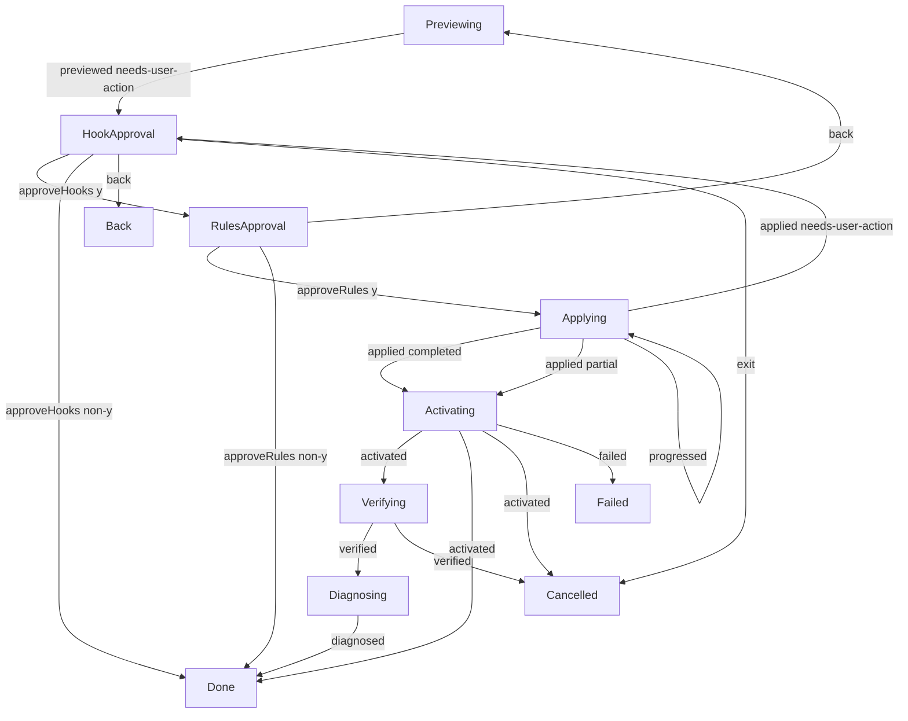
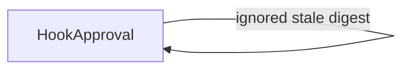

# Setup interaction

**Purpose:** Show production setup approval, observed mutation and readiness transitions.
**Status:** Maintained generated diagram.
**Authority:** Implementation and controlled validation evidence for #244; accepted installation and credential contracts retain authority.
**Expected use:** Inspect bounded scenarios and run `npm run interaction:diagrams:check` for non-writing freshness.
**Lifecycle:** Regenerate with `npm run interaction:diagrams:write` when the reducer, interpreter or scenarios change; review when setup authorization or credential behavior changes.

Fifteen bounded scenarios replay the actual production setup interpreter with controlled owners and scripted interaction. Independent assertions check separate hook and rule consent, current digest forwarding, initial noninteractive preview, changed-proposal reapproval, Back/Exit/EOF, retained partial and credential busy/indeterminate observations, hidden/verification cancellation, true effect interruption after observed installation, failed activation, and no keys in models, transitions or output. These replays perform no credential-store access or provider requests. Owner, terminal, installed-package and platform behavior require their separate checks. Diagram freshness is not exhaustive correctness evidence.

Setup delegates mutation to the existing setup owner. Installation, credential availability, public-command activation, optional paid key verification, offline readiness, native trust and actual observed review are distinct. Back retains prior observations and invalidates current consent. A changed proposal requires a new preview and approval. Hidden cancellation completes required public-command activation for observed completed or partial installation, then ends input, paid checks and doctor without claiming rollback. An interrupted owner cannot fabricate completion or activation.

## Ignored input

Independent replay assertions submit a repeated command completion and a stale approval digest to the actual reducer. They return the same model and authorize no command. These ignored inputs are separate from state-changing edges above; this is session correlation, not process-wide exactly-once evidence.

## Replay correlation

Only safe stage statuses and revision/command identities are retained. Raw owner records, credentials and provider payloads are excluded.

| Replay | Input revision | Event | Command identity | Output revision |
| --- | --- | --- | --- | --- |
| approved | 0 | previewed needs-user-action | 0 | 1 |
| approved | 1 | approveHooks y | — | 2 |
| approved | 2 | approveRules y | — | 3 |
| approved | 3 | applied completed | 3 | 4 |
| approved | 4 | activated | 4 | 5 |
| approved | 5 | verified | 5 | 6 |
| approved | 6 | diagnosed | 6 | 7 |
| declined-hooks | 0 | previewed needs-user-action | 0 | 1 |
| declined-hooks | 1 | approveHooks non-y | — | 2 |
| declined-rules | 0 | previewed needs-user-action | 0 | 1 |
| declined-rules | 1 | approveHooks y | — | 2 |
| declined-rules | 2 | approveRules non-y | — | 3 |
| back | 0 | previewed needs-user-action | 0 | 1 |
| back | 1 | back | — | 2 |
| exit | 0 | previewed needs-user-action | 0 | 1 |
| exit | 1 | exit | — | 2 |
| eof | 0 | previewed needs-user-action | 0 | 1 |
| eof | 1 | exit | — | 2 |
| rules-back | 0 | previewed needs-user-action | 0 | 1 |
| rules-back | 1 | approveHooks y | — | 2 |
| rules-back | 2 | back | — | 3 |
| rules-back | 3 | previewed needs-user-action | 3 | 4 |
| rules-back | 4 | approveHooks y | — | 5 |
| rules-back | 5 | approveRules y | — | 6 |
| rules-back | 6 | applied completed | 6 | 7 |
| rules-back | 7 | activated | 7 | 8 |
| rules-back | 8 | verified | 8 | 9 |
| rules-back | 9 | diagnosed | 9 | 10 |
| changed-proposal | 0 | previewed needs-user-action | 0 | 1 |
| changed-proposal | 1 | approveHooks y | — | 2 |
| changed-proposal | 2 | approveRules y | — | 3 |
| changed-proposal | 3 | applied needs-user-action | 3 | 4 |
| changed-proposal | 4 | approveHooks y | — | 5 |
| changed-proposal | 5 | approveRules y | — | 6 |
| changed-proposal | 6 | applied completed | 6 | 7 |
| changed-proposal | 7 | activated | 7 | 8 |
| changed-proposal | 8 | verified | 8 | 9 |
| changed-proposal | 9 | diagnosed | 9 | 10 |
| partial | 0 | previewed needs-user-action | 0 | 1 |
| partial | 1 | approveHooks y | — | 2 |
| partial | 2 | approveRules y | — | 3 |
| partial | 3 | applied partial | 3 | 4 |
| partial | 4 | activated | 4 | 5 |
| credential-busy | 0 | previewed needs-user-action | 0 | 1 |
| credential-busy | 1 | approveHooks y | — | 2 |
| credential-busy | 2 | approveRules y | — | 3 |
| credential-busy | 3 | applied completed | 3 | 4 |
| credential-busy | 4 | activated | 4 | 5 |
| credential-indeterminate | 0 | previewed needs-user-action | 0 | 1 |
| credential-indeterminate | 1 | approveHooks y | — | 2 |
| credential-indeterminate | 2 | approveRules y | — | 3 |
| credential-indeterminate | 3 | applied completed | 3 | 4 |
| credential-indeterminate | 4 | activated | 4 | 5 |
| hidden-cancelled | 0 | previewed needs-user-action | 0 | 1 |
| hidden-cancelled | 1 | approveHooks y | — | 2 |
| hidden-cancelled | 2 | approveRules y | — | 3 |
| hidden-cancelled | 3 | applied completed | 3 | 4 |
| hidden-cancelled | 4 | activated | 4 | 5 |
| verification-cancelled | 0 | previewed needs-user-action | 0 | 1 |
| verification-cancelled | 1 | approveHooks y | — | 2 |
| verification-cancelled | 2 | approveRules y | — | 3 |
| verification-cancelled | 3 | applied completed | 3 | 4 |
| verification-cancelled | 4 | activated | 4 | 5 |
| verification-cancelled | 5 | verified | 5 | 6 |
| activation-failed | 0 | previewed needs-user-action | 0 | 1 |
| activation-failed | 1 | approveHooks y | — | 2 |
| activation-failed | 2 | approveRules y | — | 3 |
| activation-failed | 3 | applied completed | 3 | 4 |
| activation-failed | 4 | failed | 4 | 5 |
| interrupted | 0 | previewed needs-user-action | 0 | 1 |
| interrupted | 1 | approveHooks y | — | 2 |
| interrupted | 2 | approveRules y | — | 3 |
| interrupted | 3 | progressed | 3 | 3 |
