# Setup interaction

**Purpose:** Show the CLI setup journey from agent selection through per-agent approval, credential saving, verification and readiness.
**Audience:** Contributors, including coding agents; Product and specification owners reviewing CLI journeys.
**Status:** Maintained generated diagram.
**Authority:** Implementation and controlled validation evidence for #244; accepted installation and credential contracts retain authority.
**Expected use:** Understand setup choices and outcomes and run `npm run interaction:diagrams:check` for non-writing freshness.
**Lifecycle:** Regenerate with `npm run interaction:diagrams:write` when the reducer, interpreter or diagram generation changes; review when setup authorization or credential behavior changes.

```mermaid
flowchart TD
  SelectSetup["hapsland setup"]
  SelectSetup -->|"Begin"| setup_selection_selection_SelectingAgents
  setup_selection_selection_SelectingAgents["Select agents to configure"]
  setup_selection_selection_RunningAgents["Run setup for the next selected agent"]
  setup_selection_selection_SelectingAgents -->|"Select"| setup_selection_selection_RunningAgents
  setup_selection_selection_RunningAgents -->|"Continue"| setup_codex_Previewing
  setup_codex_Previewing["Codex: Review proposed setup"]
  setup_codex_HookApproval["Codex: Approve hook installation?"]
  setup_codex_Previewing -->|"Changes require approval"| setup_codex_HookApproval
  setup_codex_RulesApproval["Codex: Approve rule changes?"]
  setup_codex_HookApproval -->|"Yes, install hooks"| setup_codex_RulesApproval
  setup_codex_Applying["Codex: Install approved changes"]
  setup_codex_RulesApproval -->|"Yes, change rules"| setup_codex_Applying
  setup_codex_Applying -->|"No active credential; enter a key"| login_codex_SelectingDestination
  login_codex_SelectingDestination["Codex: Choose where to save the key"]
  login_codex_PreparingTarget["Codex: Check the destination"]
  login_codex_SelectingDestination -->|"Select"| login_codex_PreparingTarget
  login_codex_EnteringKey["Codex: Enter the key privately"]
  login_codex_PreparingTarget -->|"Destination checked"| login_codex_EnteringKey
  login_codex_ConfirmingSave["Codex: Confirm saving the key"]
  login_codex_EnteringKey -->|"Key entered"| login_codex_ConfirmingSave
  login_codex_SavingKey["Codex: Save the key"]
  login_codex_ConfirmingSave -->|"Yes, save the key"| login_codex_SavingKey
  login_codex_CheckingActive["Codex: Show the credential currently in use"]
  login_codex_SavingKey -->|"Key saved"| login_codex_CheckingActive
  login_codex_Done["Codex: Show the result"]
  login_codex_CheckingActive -->|"Active source identified"| login_codex_Done
  login_codex_Done -->|"Return"| setup_codex_Applying_returned
  setup_codex_Applying_returned["Codex: Install approved changes"]
  setup_codex_Activating["Codex: Activate the public command"]
  setup_codex_Applying_returned -->|"Installation completed"| setup_codex_Activating
  setup_codex_Verifying["Codex: Offer an optional paid key check"]
  setup_codex_Activating -->|"Activation finished"| setup_codex_Verifying
  setup_codex_Verifying -->|"Continue"| verification_codex_Loading
  verification_codex_Loading["Codex: Read the active credential source"]
  verification_codex_Approval["Codex: Approve a paid key check?"]
  verification_codex_Loading -->|"File key available"| verification_codex_Approval
  verification_codex_Done["Codex: Show the check or save result"]
  verification_codex_Approval -->|"Decline"| verification_codex_Done
  verification_codex_Done -->|"Return"| setup_codex_Verifying_returned
  setup_codex_Verifying_returned["Codex: Offer an optional paid key check"]
  setup_codex_Diagnosing["Codex: Check readiness"]
  setup_codex_Verifying_returned -->|"Credential check finished"| setup_codex_Diagnosing
  setup_codex_Done["Codex: Show setup result"]
  setup_codex_Diagnosing -->|"Readiness checks finished"| setup_codex_Done
  setup_codex_Done -->|"Return"| setup_selection_selection_RunningAgents_returned
  setup_selection_selection_RunningAgents_returned["Run setup for the next selected agent"]
  setup_selection_selection_RunningAgents_returned -->|"Agent setup completed"| setup_selection_selection_RunningAgents
  setup_selection_selection_RunningAgents -->|"Continue"| setup_claude_Previewing
  setup_claude_Previewing["Claude: Review proposed setup"]
  setup_claude_HookApproval["Claude: Approve hook installation?"]
  setup_claude_Previewing -->|"Changes require approval"| setup_claude_HookApproval
  setup_claude_RulesApproval["Claude: Approve rule changes?"]
  setup_claude_HookApproval -->|"Yes, install hooks"| setup_claude_RulesApproval
  setup_claude_Applying["Claude: Install approved changes"]
  setup_claude_RulesApproval -->|"Yes, change rules"| setup_claude_Applying
  setup_claude_Applying -->|"No active credential; enter a key"| login_claude_SelectingDestination
  login_claude_SelectingDestination["Claude: Choose where to save the key"]
  login_claude_PreparingTarget["Claude: Check the destination"]
  login_claude_SelectingDestination -->|"Select"| login_claude_PreparingTarget
  login_claude_EnteringKey["Claude: Enter the key privately"]
  login_claude_PreparingTarget -->|"Destination checked"| login_claude_EnteringKey
  login_claude_ConfirmingSave["Claude: Confirm saving the key"]
  login_claude_EnteringKey -->|"Key entered"| login_claude_ConfirmingSave
  login_claude_SavingKey["Claude: Save the key"]
  login_claude_ConfirmingSave -->|"Yes, save the key"| login_claude_SavingKey
  login_claude_CheckingActive["Claude: Show the credential currently in use"]
  login_claude_SavingKey -->|"Key saved"| login_claude_CheckingActive
  login_claude_Done["Claude: Show the result"]
  login_claude_CheckingActive -->|"Active source identified"| login_claude_Done
  login_claude_Done -->|"Return"| setup_claude_Applying_returned
  setup_claude_Applying_returned["Claude: Install approved changes"]
  setup_claude_Activating["Claude: Activate the public command"]
  setup_claude_Applying_returned -->|"Installation completed"| setup_claude_Activating
  setup_claude_Verifying["Claude: Offer an optional paid key check"]
  setup_claude_Activating -->|"Activation finished"| setup_claude_Verifying
  setup_claude_Verifying -->|"Continue"| verification_claude_Loading
  verification_claude_Loading["Claude: Read the active credential source"]
  verification_claude_Approval["Claude: Approve a paid key check?"]
  verification_claude_Loading -->|"File key available"| verification_claude_Approval
  verification_claude_Done["Claude: Show the check or save result"]
  verification_claude_Approval -->|"Decline"| verification_claude_Done
  verification_claude_Done -->|"Return"| setup_claude_Verifying_returned
  setup_claude_Verifying_returned["Claude: Offer an optional paid key check"]
  setup_claude_Diagnosing["Claude: Check readiness"]
  setup_claude_Verifying_returned -->|"Credential check finished"| setup_claude_Diagnosing
  setup_claude_Done["Claude: Show setup result"]
  setup_claude_Diagnosing -->|"Readiness checks finished"| setup_claude_Done
  setup_claude_Done -->|"Return"| setup_selection_selection_RunningAgents_returned
  setup_selection_selection_Done["Finish agent selection"]
  setup_selection_selection_RunningAgents_returned -->|"Agent setup completed"| setup_selection_selection_Done
  setup_codex_Back["Codex: Return to agent selection"]
  setup_codex_HookApproval -->|"Back"| setup_codex_Back
  setup_codex_Back -->|"Return"| setup_selection_selection_RunningAgents_returned
  setup_selection_selection_RunningAgents_returned -->|"Back from agent setup"| setup_selection_selection_SelectingAgents
  setup_selection_selection_SelectingAgents -->|"Exit or end of input"| setup_selection_selection_Done
  setup_codex_Cancelled["Codex: End setup navigation"]
  setup_codex_HookApproval -->|"Exit or end of input"| setup_codex_Cancelled
  setup_codex_Cancelled -->|"Return"| setup_selection_selection_RunningAgents_returned
  setup_selection_selection_Cancelled["Stop before configuring later agents"]
  setup_selection_selection_RunningAgents_returned -->|"Agent setup cancelled"| setup_selection_selection_Cancelled
  verification_codex_Cancelled["Codex: End credential verification"]
  verification_codex_Approval -->|"Exit or end of input"| verification_codex_Cancelled
  verification_codex_Cancelled -->|"Return"| setup_codex_Verifying_returned
  setup_codex_Verifying_returned -->|"Credential check finished"| setup_codex_Cancelled
  NamedSetup["hapsland setup &lt;agent&gt;"]
  NamedSetup -->|"Begin"| setup_codex_Previewing
  setup_codex_Applying -->|"Installation completed"| setup_codex_Activating
  verification_codex_Checking["Codex: Check the key"]
  verification_codex_Approval -->|"Yes"| verification_codex_Checking
  verification_codex_Checking -->|"Key accepted"| verification_codex_Done
  setup_codex_Failed["Codex: Show activation failure"]
  verification_codex_Done -->|"Credential check finished"| setup_codex_Diagnosing
  setup_codex_HookApproval -->|"Decline hook installation"| setup_codex_Done
  setup_codex_RulesApproval -->|"Decline rule changes"| setup_codex_Done
  setup_codex_RulesApproval -->|"Back"| setup_codex_Previewing
  setup_codex_Applying -->|"Proposal changed; review again"| setup_codex_HookApproval
  setup_codex_Applying -->|"Installation partly completed"| setup_codex_Activating
  setup_codex_Activating -->|"Activation finished"| setup_codex_Done
  setup_codex_Activating -->|"Activation finished"| setup_codex_Cancelled
  verification_codex_Cancelled -->|"Credential check finished"| setup_codex_Cancelled
  setup_codex_Activating -->|"Activation failed"| setup_codex_Failed
  setup_codex_Applying -->|"Show installation progress"| setup_codex_Applying
```

Run `hapsland setup` to select agents, or `hapsland setup <agent>` to configure a named agent directly. Selected agents are configured in order. Review the proposed setup, then approve hooks and rules separately. Back returns to the previous choice; a changed proposal requires another review and approval. Completed or partial installation remains visible if later activation or input fails. Optional paid credential verification has its own consent; readiness checks follow separately. Exiting does not undo completed changes.

