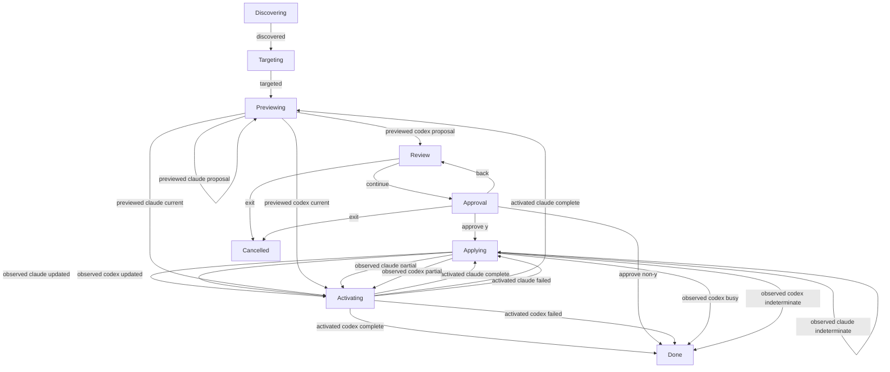

# Update interaction

**Purpose:** Show production grouped update and its witnessed command correlation.
**Status:** Maintained generated diagram.
**Authority:** Implementation and controlled validation evidence for #244; accepted installation contracts and lifecycle owners retain authority.
**Expected use:** Inspect grouped approval, Back, observed mutation and activation outcomes; run `npm run interaction:diagrams:check` for non-writing freshness.
**Lifecycle:** Regenerate with `npm run interaction:diagrams:write` when the reducer, interpreter or replay cases change; review when accepted update behavior changes.

Nine bounded replays run the production interpreter with scripted input and controlled owners. Independent assertions check both previews before mutation, exact per-agent digest forwarding, mutation counts, input consumption and durable outcomes. They perform no installation or credential access and do not validate physical terminals or installed platforms. Current targets activate without mutation approval, preserving existing behavior. Group approval covers all proposed profiles; Escape at approval returns to Review. Partial, busy and indeterminate results remain observations. Failed activation cannot erase an observed update. Explicit JSON preview/update commands remain direct automation exceptions.

## Replay correlation

Labels exclude environment, paths, credential values and full owner previews. Revisions and command identities correlate session events; owner digests authorize actual mutations. Same-phase edges below advance to another agent and are state-changing transitions, not ignored input.

| Replay | Input revision | Event | Command identity | Output revision |
| --- | --- | --- | --- | --- |
| apply | 0 | discovered | 0 | 1 |
| apply | 1 | targeted | 1 | 2 |
| apply | 2 | previewed claude proposal | 2 | 3 |
| apply | 3 | previewed codex proposal | 3 | 4 |
| apply | 4 | continue | — | 5 |
| apply | 5 | approve y | — | 6 |
| apply | 6 | observed claude updated | 6 | 7 |
| apply | 7 | activated claude complete | 7 | 8 |
| apply | 8 | observed codex updated | 8 | 9 |
| apply | 9 | activated codex complete | 9 | 10 |
| decline | 0 | discovered | 0 | 1 |
| decline | 1 | targeted | 1 | 2 |
| decline | 2 | previewed claude proposal | 2 | 3 |
| decline | 3 | previewed codex proposal | 3 | 4 |
| decline | 4 | continue | — | 5 |
| decline | 5 | approve non-y | — | 6 |
| back-exit | 0 | discovered | 0 | 1 |
| back-exit | 1 | targeted | 1 | 2 |
| back-exit | 2 | previewed claude proposal | 2 | 3 |
| back-exit | 3 | previewed codex proposal | 3 | 4 |
| back-exit | 4 | continue | — | 5 |
| back-exit | 5 | back | — | 6 |
| back-exit | 6 | exit | — | 7 |
| eof | 0 | discovered | 0 | 1 |
| eof | 1 | targeted | 1 | 2 |
| eof | 2 | previewed claude proposal | 2 | 3 |
| eof | 3 | previewed codex proposal | 3 | 4 |
| eof | 4 | continue | — | 5 |
| eof | 5 | exit | — | 6 |
| current | 0 | discovered | 0 | 1 |
| current | 1 | targeted | 1 | 2 |
| current | 2 | previewed claude current | 2 | 3 |
| current | 3 | activated claude complete | 3 | 4 |
| current | 4 | previewed codex current | 4 | 5 |
| current | 5 | activated codex complete | 5 | 6 |
| partial | 0 | discovered | 0 | 1 |
| partial | 1 | targeted | 1 | 2 |
| partial | 2 | previewed claude proposal | 2 | 3 |
| partial | 3 | previewed codex proposal | 3 | 4 |
| partial | 4 | continue | — | 5 |
| partial | 5 | approve y | — | 6 |
| partial | 6 | observed claude partial | 6 | 7 |
| partial | 7 | activated claude complete | 7 | 8 |
| partial | 8 | observed codex partial | 8 | 9 |
| partial | 9 | activated codex complete | 9 | 10 |
| activation-failed | 0 | discovered | 0 | 1 |
| activation-failed | 1 | targeted | 1 | 2 |
| activation-failed | 2 | previewed claude proposal | 2 | 3 |
| activation-failed | 3 | previewed codex proposal | 3 | 4 |
| activation-failed | 4 | continue | — | 5 |
| activation-failed | 5 | approve y | — | 6 |
| activation-failed | 6 | observed claude updated | 6 | 7 |
| activation-failed | 7 | activated claude failed | 7 | 8 |
| activation-failed | 8 | observed codex updated | 8 | 9 |
| activation-failed | 9 | activated codex failed | 9 | 10 |
| busy | 0 | discovered | 0 | 1 |
| busy | 1 | targeted | 1 | 2 |
| busy | 2 | previewed claude proposal | 2 | 3 |
| busy | 3 | previewed codex proposal | 3 | 4 |
| busy | 4 | continue | — | 5 |
| busy | 5 | approve y | — | 6 |
| busy | 6 | observed claude busy | 6 | 7 |
| busy | 7 | observed codex busy | 7 | 8 |
| indeterminate | 0 | discovered | 0 | 1 |
| indeterminate | 1 | targeted | 1 | 2 |
| indeterminate | 2 | previewed claude proposal | 2 | 3 |
| indeterminate | 3 | previewed codex proposal | 3 | 4 |
| indeterminate | 4 | continue | — | 5 |
| indeterminate | 5 | approve y | — | 6 |
| indeterminate | 6 | observed claude indeterminate | 6 | 7 |
| indeterminate | 7 | observed codex indeterminate | 7 | 8 |
