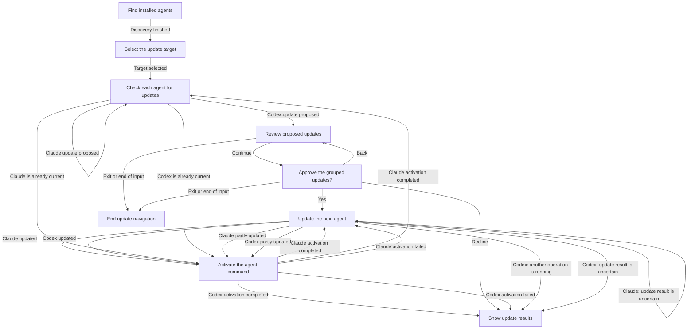

# Update interaction

**Purpose:** Show grouped update review, approval and outcomes.
**Status:** Maintained generated diagram.
**Authority:** Implementation and controlled validation evidence for #244; accepted installation contracts and lifecycle owners retain authority.
**Expected use:** Inspect grouped approval, Back, observed mutation and activation outcomes; run `npm run interaction:diagrams:check` for non-writing freshness.
**Lifecycle:** Regenerate with `npm run interaction:diagrams:write` when the reducer, interpreter or generated flow changes; review when accepted update behavior changes.

Review proposed updates for all selected agents before approving the group. Back returns to the review; Exit ends navigation. Agents that are already current activate without an update. Partial updates, busy operations and uncertain results remain visible. Activation failure does not undo a completed update. JSON preview and update commands remain direct automation paths.

