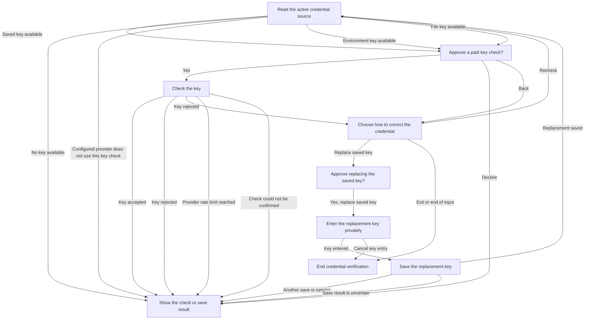

# Credential verification and replacement interaction

**Purpose:** Show production paid-check consent, source-specific correction and replacement outcomes.
**Status:** Maintained generated diagram.
**Authority:** Implementation and controlled validation evidence for #244; accepted credential and installation contracts retain authority.
**Expected use:** Understand paid-check consent and recovery; run `npm run interaction:diagrams:check` for non-writing freshness.
**Lifecycle:** Regenerate with `npm run interaction:diagrams:write` when the reducer, interpreter or diagram generation changes; review when accepted verification or credential behavior changes.

Review the active credential source before approving a paid check. Each retry needs fresh approval, with at most three checks. Replacing a saved key needs separate confirmation and private input. For a file credential, correct the file and choose Recheck; for an environment credential, update the launch environment. Busy or uncertain saving stops further checks. A successful key check does not establish agent trust or a completed code review.

