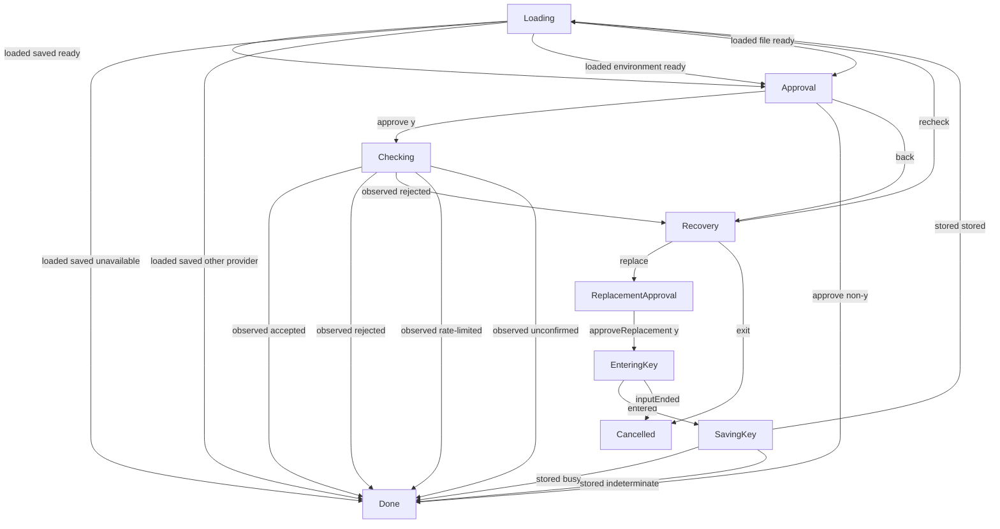

# Credential verification and replacement interaction

**Purpose:** Show production paid-check consent, source-specific correction and replacement outcomes.
**Status:** Maintained generated diagram.
**Authority:** Implementation and controlled validation evidence for #244; accepted credential and installation contracts retain authority.
**Expected use:** Inspect bounded request consent and recovery; run `npm run interaction:diagrams:check` for non-writing freshness.
**Lifecycle:** Regenerate with `npm run interaction:diagrams:write` when the reducer, interpreter or named scenarios change; review when accepted verification or credential behavior changes.

Fifteen bounded replays run the actual production interpreter with scripted input and controlled owners. Independent assertions check a fresh approval per request, a maximum of three checks, source-specific correction, save counts, retained results, exact input consumption and absence of keys from models, transitions and output. These replays perform no paid requests or credential-store access. Separate provider tests establish the built-in greeting, sanitized outcomes and 15-second timeout; separate storage and terminal tests own those physical boundaries.

Selecting replacement does not save a key. Saving requires its own confirmation and built-in hidden capture; every subsequent paid check needs fresh consent after normal precedence is resolved again. File correction only rereads the file; environment rejection gives launch-environment guidance. Busy and indeterminate saves remain visible and cause no subsequent check. Hidden cancellation ends the conversation. A successful key check is not evidence of native agent trust or a real code review.

## Replay correlation

Labels omit credentials, file paths and raw provider payloads. Session revision and credential-selection revision reject stale answers/completions; native credential locks and journals remain authoritative. The graph records accepted transitions. Focused tests separately assert ignored stale events and preservation of observations during Back/Exit.

| Replay | Input revision | Event | Command identity | Credential revision | Output revision |
| --- | --- | --- | --- | --- | --- |
| accepted | 0 | loaded saved ready | 0 | — | 1 |
| accepted | 1 | approve y | — | 1 | 2 |
| accepted | 2 | observed accepted | 2 | 1 | 3 |
| declined | 0 | loaded saved ready | 0 | — | 1 |
| declined | 1 | approve non-y | — | 1 | 2 |
| missing | 0 | loaded saved unavailable | 0 | — | 1 |
| other-provider | 0 | loaded saved other provider | 0 | — | 1 |
| environment-rejected | 0 | loaded environment ready | 0 | — | 1 |
| environment-rejected | 1 | approve y | — | 1 | 2 |
| environment-rejected | 2 | observed rejected | 2 | 1 | 3 |
| file-corrected | 0 | loaded file ready | 0 | — | 1 |
| file-corrected | 1 | approve y | — | 1 | 2 |
| file-corrected | 2 | observed rejected | 2 | 1 | 3 |
| file-corrected | 3 | recheck | — | — | 4 |
| file-corrected | 4 | loaded file ready | 4 | — | 5 |
| file-corrected | 5 | approve y | — | 2 | 6 |
| file-corrected | 6 | observed accepted | 6 | 2 | 7 |
| replacement | 0 | loaded saved ready | 0 | — | 1 |
| replacement | 1 | approve y | — | 1 | 2 |
| replacement | 2 | observed rejected | 2 | 1 | 3 |
| replacement | 3 | replace | — | — | 4 |
| replacement | 4 | approveReplacement y | — | 1 | 5 |
| replacement | 5 | entered | 5 | — | 6 |
| replacement | 6 | stored stored | 6 | — | 7 |
| replacement | 7 | loaded saved ready | 7 | — | 8 |
| replacement | 8 | approve y | — | 2 | 9 |
| replacement | 9 | observed accepted | 9 | 2 | 10 |
| stored-declined | 0 | loaded saved ready | 0 | — | 1 |
| stored-declined | 1 | approve y | — | 1 | 2 |
| stored-declined | 2 | observed rejected | 2 | 1 | 3 |
| stored-declined | 3 | replace | — | — | 4 |
| stored-declined | 4 | approveReplacement y | — | 1 | 5 |
| stored-declined | 5 | entered | 5 | — | 6 |
| stored-declined | 6 | stored stored | 6 | — | 7 |
| stored-declined | 7 | loaded saved ready | 7 | — | 8 |
| stored-declined | 8 | approve non-y | — | 2 | 9 |
| stored-back-exit | 0 | loaded saved ready | 0 | — | 1 |
| stored-back-exit | 1 | approve y | — | 1 | 2 |
| stored-back-exit | 2 | observed rejected | 2 | 1 | 3 |
| stored-back-exit | 3 | replace | — | — | 4 |
| stored-back-exit | 4 | approveReplacement y | — | 1 | 5 |
| stored-back-exit | 5 | entered | 5 | — | 6 |
| stored-back-exit | 6 | stored stored | 6 | — | 7 |
| stored-back-exit | 7 | loaded saved ready | 7 | — | 8 |
| stored-back-exit | 8 | back | — | — | 9 |
| stored-back-exit | 9 | exit | — | — | 10 |
| hidden-eof | 0 | loaded saved ready | 0 | — | 1 |
| hidden-eof | 1 | approve y | — | 1 | 2 |
| hidden-eof | 2 | observed rejected | 2 | 1 | 3 |
| hidden-eof | 3 | replace | — | — | 4 |
| hidden-eof | 4 | approveReplacement y | — | 1 | 5 |
| hidden-eof | 5 | inputEnded | 5 | — | 6 |
| busy | 0 | loaded saved ready | 0 | — | 1 |
| busy | 1 | approve y | — | 1 | 2 |
| busy | 2 | observed rejected | 2 | 1 | 3 |
| busy | 3 | replace | — | — | 4 |
| busy | 4 | approveReplacement y | — | 1 | 5 |
| busy | 5 | entered | 5 | — | 6 |
| busy | 6 | stored busy | 6 | — | 7 |
| indeterminate | 0 | loaded saved ready | 0 | — | 1 |
| indeterminate | 1 | approve y | — | 1 | 2 |
| indeterminate | 2 | observed rejected | 2 | 1 | 3 |
| indeterminate | 3 | replace | — | — | 4 |
| indeterminate | 4 | approveReplacement y | — | 1 | 5 |
| indeterminate | 5 | entered | 5 | — | 6 |
| indeterminate | 6 | stored indeterminate | 6 | — | 7 |
| three-check-limit | 0 | loaded saved ready | 0 | — | 1 |
| three-check-limit | 1 | approve y | — | 1 | 2 |
| three-check-limit | 2 | observed rejected | 2 | 1 | 3 |
| three-check-limit | 3 | recheck | — | — | 4 |
| three-check-limit | 4 | loaded saved ready | 4 | — | 5 |
| three-check-limit | 5 | approve y | — | 2 | 6 |
| three-check-limit | 6 | observed rejected | 6 | 2 | 7 |
| three-check-limit | 7 | recheck | — | — | 8 |
| three-check-limit | 8 | loaded saved ready | 8 | — | 9 |
| three-check-limit | 9 | approve y | — | 3 | 10 |
| three-check-limit | 10 | observed rejected | 10 | 3 | 11 |
| rate-limited | 0 | loaded saved ready | 0 | — | 1 |
| rate-limited | 1 | approve y | — | 1 | 2 |
| rate-limited | 2 | observed rate-limited | 2 | 1 | 3 |
| unconfirmed | 0 | loaded saved ready | 0 | — | 1 |
| unconfirmed | 1 | approve y | — | 1 | 2 |
| unconfirmed | 2 | observed unconfirmed | 2 | 1 | 3 |
