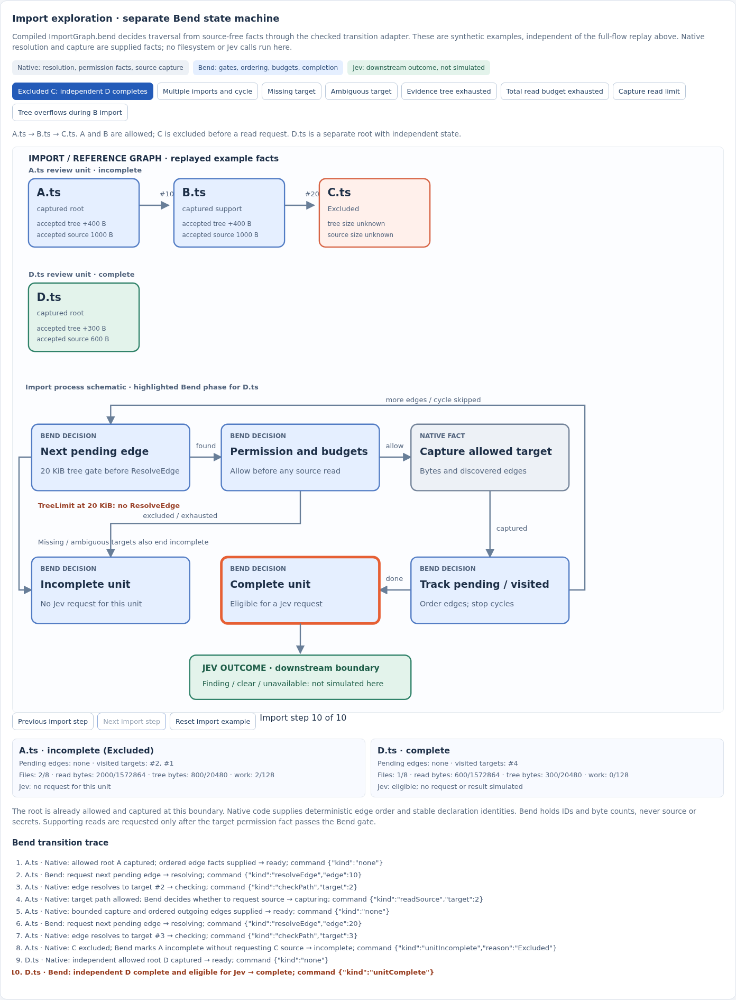
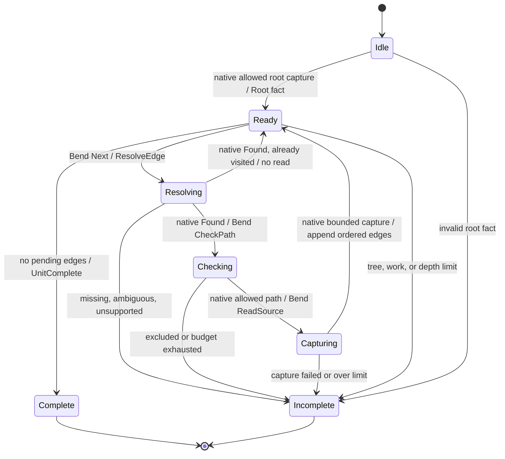

# #141: Bend import-graph state machine

Status: Bend-first policy definition and separate dashboard diagram for review. This is a source-free model and checked adapter, **not** an installed cross-file reader or a Jev request path. [#117 authority audit](bend-logic-authority-map.md) and [#118 requirements crosswalk](bend-requirements-crosswalk.md) precede it. The target behavior comes from the [amended #93 specification](issue-93-type-function-review-spec.md) and [#138 integration task](https://github.com/dearlordylord/hapsland/issues/138).

[`ImportGraph.bend`](../packages/agent-flow-bend/ImportGraph.bend) defines one unit's pending edges, visited declaration IDs, phase, source-free counters, and terminal result. [`import-graph-adapter.ts`](../packages/agent-flow-bend/import-graph-adapter.ts) validates the compiled constructors and is the shared entry point for the [separate dashboard view](../packages/agent-flow-viz/src/import-graph-view.ts). Production adoption in #133/#138 will use this boundary within the #119 canonical transition rather than calling generated graph JavaScript directly. The existing full-flow page remains the abstract `Flow.step` replay until #135.

## Fact and decision boundary

| Native fact or effect | Bend decision |
| --- | --- |
| Parse syntax and binding; assign stable source-free edge and declaration IDs in deterministic source order with canonical path/declaration tie-breaks. Resolve only repository-contained paths and physical identities. | Pop the next pending edge in FIFO order. Repeated declaration identity is included without another source request. Cycle terminates. |
| Check containment, protected paths, Git ignore, and effective user selection **before source read**; report one `PathChecked` fact. | Excluded path makes the dependent unit incomplete. An allowed path alone does not trigger a read until file, total-read, tree, depth, and work budgets pass. |
| Execute `ReadSource` at most once per declaration identity; capture stable source, encoded tree contribution, and ordered outgoing edge IDs, or report `CaptureFailed`. | Update visited/pending sets and counters, or mark the entire unit incomplete. No partial tree reaches rule selection or Jev. |
| Measure deadline and report `DeadlineReached`. Run Jev only later for complete units selected by the canonical review transition. | End with `UnitComplete` or source-free `UnitIncomplete(reason)`. Independent units have separate graph state and can continue. |

For the first supported implementation, the intended native resolver handles statically bound named relative TypeScript imports, including `import type` and `as` aliases, to uniquely identified named type or top-level function declarations in `.ts`, `.tsx`, `.mts`, or `.cts` files. An extensionless relative specifier may resolve through a deterministic finite candidate order fixed by the native conformance fixture. Package/URL/path-alias imports, barrels/reexports, default/namespace/dynamic imports, `require`, declaration merging, and ambiguous or unsupported bindings are incomplete **when required by the selected root**. This is a proposed finite adoption boundary; #133/#138 must freeze the exact resolver order and fixtures before production egress. The model receives only the resulting `Found`/`NotFound`/`Many`/`Unhandled` fact and cannot claim parsing support by itself.

## Initial finite budgets and ordering

| Budget | Bend behavior |
| --- | --- |
| 256 KiB per captured file, inclusive | Reject an oversized root or supporting capture. Native capture must stop at the same bound. |
| 20 KiB canonical encoded evidence tree per unit, inclusive | Reject a node that would exceed the bound. If exactly full with pending edges, `Next` ends incomplete **before requesting another resolution or read**. The tree includes root, nodes, edges, and required metadata; #93 adoption still must freeze its encoding. |
| Eight total files and 1.5 MiB total source bytes per unit | Before `ReadSource`, reserve the full 256 KiB possible file size against the total-read ceiling; after capture, charge actual bytes. This conservative gate keeps reads bounded while allowing small-file graphs to reach the file count limit. |
| 16 outgoing targets per captured node, four reference edges per path, 128 edge work steps | Oversized outgoing lists, depth, or work make the unit incomplete. Native analysis also has to enforce at most 64 parsed declarations per file and an actual finite deadline; the deadline is represented by `DeadlineReached`. |

The queue appends each captured node's edge facts after existing pending edges, so multiple imports follow stable breadth-first source order. A visited key is the native stable declaration identity (canonical path, kind, declaration identity). IDs must be collision-free within the unit; the adapter rejects malformed numeric inputs and the native conformance gate must verify identity assignment. The Bend state retains IDs and counts only; it does not contain paths, symbols, source, hashes, credentials, or Jev output.

## Expected trace evidence

The independent [source-free fixture](../conformance/import-graph-v1.json) and [checker](../packages/agent-flow-bend/scripts/check-import-graph.mjs) assert ordered commands, phases, and final state for A → B → excluded C, an independent complete D unit, a cycle, exact tree exhaustion before resolution, and B's contribution exceeding the tree bound after capture. The [dashboard scenarios](../packages/agent-flow-viz/src/import-graph-view.ts) additionally show multiple imports, missing/ambiguous targets, per-file overflow, and total-read exhaustion. The diagram distinguishes native fact/effect boxes, Bend transitions, and the downstream Jev boundary; it runs no filesystem read or Jev call. Three [Bend laws and proofs](../packages/agent-flow-bend/LAWS.bend) check exclusion never commands a read, a visited cycle needs no source, and exact tree exhaustion stops before resolution. These finite checks do not prove the future native resolver or production wiring.
