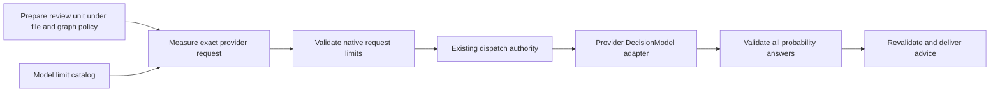

# Review providers and request limits

**Purpose:** Explain the review-provider boundary, its limit catalog, configuration, and validation gaps.
**Status:** Active implementation guidance; token-budget enforcement remains incomplete.
**Authority:** Maintained architectural guidance and implementation evidence. Vendor documentation establishes declared limits, not observed behavior or review quality; accepted review-input and advice contracts retain their authority.
**Expected use:** Add a review backend without coupling source collection or advice delivery to its transport, and choose the checks needed to validate it.
**Lifecycle:** Update with each provider, model, serializer, credential rule, or limit change. Review vendor declarations before a live milestone and whenever a model alias or upstream API changes; replace obsolete entries in place.

## Boundary

The [review resources guide](review-resources.md) explains the separate resident
preparation and classifier pools, logical capacity, source collection, and
delivery bounds. This page owns provider-specific declarations and transport
checks; those checks do not expand the resident's resources.

A review backend evaluates a prepared review unit. A provider adapter turns its
probability decisions into a transport request and validated answers. Source
collection, graph exploration, scheduling, capacity, and advice delivery retain
their existing owners. Provider request validation cannot authorize dispatch.



The [catalog](../packages/review-definition/src/review-providers/catalog.ts) records model-specific declared
limits with their source and check date. An absent limit means **unknown**;
it must never be interpreted as unlimited or copied from another provider.
The [request serializer](../packages/review-execution/src/review-providers/request.ts) measures actual
UTF-8 JSON body bytes, including questions, criteria, escaping and metadata.
[Pipeline evaluation](../packages/review-execution/src/direct-event/pipeline.ts) checks these native
constraints before calling the model. The Cloudflare adapter repeats validation
at its transport boundary for callers outside that pipeline.

<!-- provider-limits:start -->

| Model | Declared question limit | Declared HTTP body limit | Declared token limit | Checked on | Source |
| --- | --- | --- | --- | --- | --- |
| `jev-latest` | Unknown | Unknown | 64,000 per request; 32,000 for state plus longest question | 2026-10-02 | [Provider declaration](https://docs.typesafe.ai/models) |
| `clef` | 64 | 13 MiB | 65,536 context window | 2026-10-02 | [Provider declaration](https://developers.cloudflare.com/workers-ai/models/clef/) |
| `clef-flash` | 64 | 13 MiB | 65,536 context window | 2026-10-02 | [Provider declaration](https://developers.cloudflare.com/workers-ai/models/clef-flash/) |

These values are provider declarations, not results of live boundary tests. Native question-count and HTTP-body limits are enforced; token counts are unmeasured.

<!-- provider-limits:end -->

The [evidence-tree ceiling](review-resources.md#source-collection-and-provider-input) belongs to Hapsland's graph profile,
not to Jev. It applies independently of the selected provider. Selecting a model
with a larger context window does not expand collection limits.

### Token measurements are a separate unresolved boundary

Bytes are not tokens. Hapsland currently ships neither provider's tokenizer and
does not claim to enforce the declared token budgets. Large authored questions
can exceed them even when the evidence tree fits. Cloudflare documents truncation
of long state; the native byte/count checks do not prove that truncation cannot
occur. A later token counter must include question criteria and any provider
framing, and distinguish state-plus-longest-question from total-request scope.
Do not substitute a characters-per-token estimate and call it exact enforcement.

Native limit failure prevents HTTP dispatch. Hapsland does not truncate prepared
source, drop selected questions, split a unit into multiple calls, retry, or fall
back to another provider. Those changes need an explicit decision about complete
results, deadlines, accounting, and provider destination authority. Existing
unavailable handling remains in effect; there is no synthetic clear answer.
Rate limits and cost budgets are separate operational constraints. Dynamic quotas
are not hardcoded as model input limits in this catalog.

## Selection and credentials

Set the following in the **user** configuration file described in
[configuration](configuration.md). Project configuration cannot set `reviewBackend`.
<!-- jev-selection:start -->

Omission selects Jev with `jev-latest` and `TYPESAFE_API_KEY`.

<!-- jev-selection:end -->

```jsonc
{
  "version": 1,
  "reviewBackend": {
    "provider": "cloudflare",
    "model": "clef",
    "accountId": "0123456789abcdef0123456789abcdef"
  }
}
```

<!-- cloudflare-credential:start -->

Use `clef-flash` to select the other Cloudflare model. Make `CLOUDFLARE_API_TOKEN` available to the installed runtime's hook environment.

<!-- cloudflare-credential:end -->
An explicit user `credentialEnvVar` can name another variable. Configuration
contains the account ID and variable reference, never the token value.
Cloudflare's derived credential reference is user-owned and uses environment/file lookup without native fallback:
a project cannot override it, and missing Cloudflare credentials cannot fall
back to Hapsland's saved Jev key. `hapsland --login` still manages the Jev key.
Cloudflare uses a validated 32-character hexadecimal account ID and the fixed
Workers AI origin; arbitrary endpoint routing is not available.

Provider, model selector, and full destination are part of the prepared unit's
semantic identity. Model/account changes invalidate successful reuse and retained
advice. The resident rechecks the current destination after credential resolution,
before dispatch. A mutable upstream alias such as `jev-latest` can change weights
without changing its selector; this implementation does not detect that change.

The Cloudflare adapter maps qualified rule IDs to `q0`, `q1`, etc., because
Cloudflare's question IDs exclude `/`. The mapping is one-to-one and local to the
request; advice retains the original rule ID. It preserves probability instructions
and criteria, decodes the Workers AI success envelope, and requires exactly the
requested answers and model selector. Invalid output or HTTP errors produce
sanitized failures without raw credentials or source-bearing responses.

Both providers use the shared [review transport](../packages/review-execution/src/review-providers/transport.ts).
It passes every top-level JSON field through the compiled Bend projector, which
selects `model`, `state`, and `questions` and constructs the final body. It disables ambient trace-header propagation, and local inspection receives a copy
of encoded bytes so its callback cannot modify the outgoing request. The
[content-isolation contract](review-contract-compatibility.md#review-content-isolation)
states permitted inputs and the limits of the formal evidence.

## Evidence and checks

Run `npx vitest run --maxWorkers=1 src/review-providers` for offline validation.
The checks cover both model selectors, actual HTTP body/account/auth shape,
criteria and ID mapping, 64/65 questions, the exact body byte boundary with UTF-8
and escaping, malformed/failed responses, configuration ownership, and captured
provider selection across credential waits. They establish adapter behavior against controlled transports.
No live Cloudflare request, quality comparison, latency measurement, or native
agent/platform validation is claimed. The separate evaluation milestone runner
remains a Jev-specific suite.
