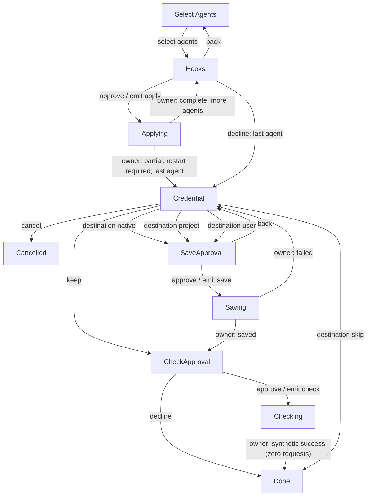
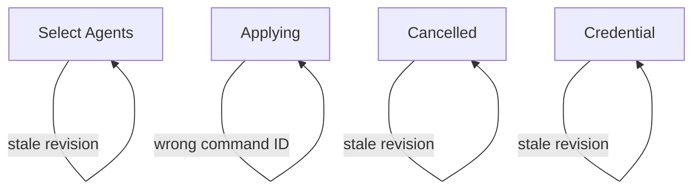

# Setup reducer replay diagram

**Purpose:** Show observed setup transitions and correlated commands from executable prototype scenarios.
**Status:** Generated throwaway prototype evidence.
**Authority:** Bounded replay evidence; not an accepted product contract or proof of all legal behavior.
**Expected use:** Preview this Markdown with Mermaid support alongside the console prototype; regenerate explicitly after reducer or scenario changes.
**Lifecycle:** Delete at the setup-interaction design acceptance milestone; consolidate adopted generator behavior and coverage limits into the production generator's owner documentation, and architectural decisions into an ADR. Update inbound links before deleting.

> This diagram shows transitions observed by the declared scenario replays through the current reducer. Regeneration keeps it current for those scenarios; it does not establish exhaustive coverage. New states, guards or context-dependent branches may remain absent until scenarios exercise them. Diagram freshness does not establish behavioral correctness.

Generated by `npm run diagram:write`; verified without rewriting by `npm run diagram:check`. Source: [scenario drivers](scenarios.ts) replayed through the [actual reducer](reducer.ts). Independent assertions inside the drivers still check behavior.

## Keyboard navigation

Escape dispatches the same Back event as the Back button on Hooks, Credential, SaveApproval and CheckApproval menus. At the first selection dialog Escape exits; hidden key entry keeps its existing cancellation/exit behavior.

Select Agents chooses agents. Hooks previews and asks approval for one agent’s hook changes. Applying executes those approved hook changes (simulated here), then returns to Hooks for another agent or proceeds to Credential after the last agent. Approve is an event, not a phase or a proof. Back from Hooks returns to Select Agents without undoing earlier applied results.

## Observed state-changing transitions

`emit` means the resulting state exposes a command to the interpreter, not that a real operation ran. Key entry uses Prompt.Hidden within the synthetic save interpreter; it is not a reducer phase and is not depicted as one.

## Observed ignored inputs

These self-loops preserve the entire model and issue no new command. An already-pending command may remain present. This companion view keeps ignored inputs out of the main flow.

## Replay details

Revisions and command IDs are retained for correlation; credential values, owner payloads and approval digests are excluded. Branch labels such as “more agents” describe the observed resulting phase, not an inferred exhaustive guard.

### two hosts, partial result, project save, separate check

Initial context: source **none**, phase **Select Agents**, revision **0**, no selected agents or prior results.

| Step | Observed phases | Event | Revision | Newly issued command |
| --- | --- | --- | --- | --- |
| 1 | Select Agents → Hooks | select agents | 0 → 1 | — |
| 2 | Hooks → Applying | approve | 1 → 2 | apply #2 |
| 3 | Applying → Hooks | owner: complete; more agents | 2 → 3 | — |
| 4 | Hooks → Applying | approve | 3 → 4 | apply #4 |
| 5 | Applying → Credential | owner: partial: restart required; last agent | 4 → 5 | — |
| 6 | Credential → SaveApproval | destination project | 5 → 6 | — |
| 7 | SaveApproval → Saving | approve | 6 → 7 | save #7 |
| 8 | Saving → CheckApproval | owner: saved | 7 → 8 | — |
| 9 | CheckApproval → Checking | approve | 8 → 9 | check #9 |
| 10 | Checking → Done | owner: synthetic success (zero requests) | 9 → 10 | — |

### back invalidates approval, wrong command ID ignored, cancel pending ignored

Initial context: source **none**, phase **Select Agents**, revision **0**, no selected agents or prior results.

| Step | Observed phases | Event | Revision | Newly issued command |
| --- | --- | --- | --- | --- |
| 1 | Select Agents → Hooks | select agents | 0 → 1 | — |
| 2 | Hooks → Select Agents | back | 1 → 2 | — |
| 3 | Select Agents → Select Agents | stale revision | 1 → 2 | — |
| 4 | Select Agents → Hooks | select agents | 2 → 3 | — |
| 5 | Hooks → Applying | approve | 3 → 4 | apply #4 |
| 6 | Applying → Applying | cancel | 4 → 4 | — |
| 7 | Applying → Applying | wrong command ID | 4 → 4 | — |
| 8 | Applying → Credential | owner: partial: restart required; last agent | 4 → 5 | — |
| 9 | Credential → SaveApproval | destination user | 5 → 6 | — |
| 10 | SaveApproval → Credential | back | 6 → 7 | — |
| 11 | Credential → Credential | stale revision | 6 → 7 | — |
| 12 | Credential → Cancelled | cancel | 7 → 8 | — |
| 13 | Cancelled → Cancelled | stale revision | 6 → 8 | — |

### destination project with higher-priority environment

Initial context: source **environment**, phase **Select Agents**, revision **0**, no selected agents or prior results.

| Step | Observed phases | Event | Revision | Newly issued command |
| --- | --- | --- | --- | --- |
| 1 | Select Agents → Hooks | select agents | 0 → 1 | — |
| 2 | Hooks → Credential | decline; last agent | 1 → 2 | — |
| 3 | Credential → SaveApproval | destination project | 2 → 3 | — |
| 4 | SaveApproval → Saving | approve | 3 → 4 | save #4 |
| 5 | Saving → CheckApproval | owner: saved | 4 → 5 | — |
| 6 | CheckApproval → Done | decline | 5 → 6 | — |

### destination user with higher-priority environment

Initial context: source **environment**, phase **Select Agents**, revision **0**, no selected agents or prior results.

| Step | Observed phases | Event | Revision | Newly issued command |
| --- | --- | --- | --- | --- |
| 1 | Select Agents → Hooks | select agents | 0 → 1 | — |
| 2 | Hooks → Credential | decline; last agent | 1 → 2 | — |
| 3 | Credential → SaveApproval | destination user | 2 → 3 | — |
| 4 | SaveApproval → Saving | approve | 3 → 4 | save #4 |
| 5 | Saving → CheckApproval | owner: saved | 4 → 5 | — |
| 6 | CheckApproval → Done | decline | 5 → 6 | — |

### destination native with higher-priority environment

Initial context: source **environment**, phase **Select Agents**, revision **0**, no selected agents or prior results.

| Step | Observed phases | Event | Revision | Newly issued command |
| --- | --- | --- | --- | --- |
| 1 | Select Agents → Hooks | select agents | 0 → 1 | — |
| 2 | Hooks → Credential | decline; last agent | 1 → 2 | — |
| 3 | Credential → SaveApproval | destination native | 2 → 3 | — |
| 4 | SaveApproval → Saving | approve | 3 → 4 | save #4 |
| 5 | Saving → CheckApproval | owner: saved | 4 → 5 | — |
| 6 | CheckApproval → Done | decline | 5 → 6 | — |

### destination skip with higher-priority environment

Initial context: source **environment**, phase **Select Agents**, revision **0**, no selected agents or prior results.

| Step | Observed phases | Event | Revision | Newly issued command |
| --- | --- | --- | --- | --- |
| 1 | Select Agents → Hooks | select agents | 0 → 1 | — |
| 2 | Hooks → Credential | decline; last agent | 1 → 2 | — |
| 3 | Credential → Done | destination skip | 2 → 3 | — |

### keep existing, no save, decline check

Initial context: source **environment**, phase **Select Agents**, revision **0**, no selected agents or prior results.

| Step | Observed phases | Event | Revision | Newly issued command |
| --- | --- | --- | --- | --- |
| 1 | Select Agents → Hooks | select agents | 0 → 1 | — |
| 2 | Hooks → Credential | decline; last agent | 1 → 2 | — |
| 3 | Credential → CheckApproval | keep | 2 → 3 | — |
| 4 | CheckApproval → Done | decline | 3 → 4 | — |

### failed save recovers, retains outcomes

Initial context: source **none**, phase **Select Agents**, revision **0**, no selected agents or prior results.

| Step | Observed phases | Event | Revision | Newly issued command |
| --- | --- | --- | --- | --- |
| 1 | Select Agents → Hooks | select agents | 0 → 1 | — |
| 2 | Hooks → Credential | decline; last agent | 1 → 2 | — |
| 3 | Credential → SaveApproval | destination user | 2 → 3 | — |
| 4 | SaveApproval → Saving | approve | 3 → 4 | save #4 |
| 5 | Saving → Credential | owner: failed | 4 → 5 | — |
| 6 | Credential → Cancelled | cancel | 5 → 6 | — |
