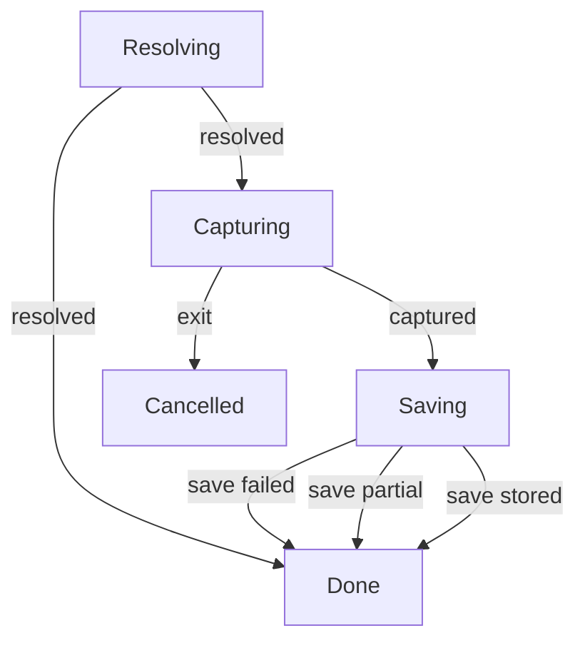

# Login workflow replay diagram

**Purpose:** Show observed login interaction transitions from named executable prototype scenarios.
**Status:** Generated prototype evidence; production owner integration is pending.
**Authority:** Bounded synthetic replay evidence, not an accepted product contract or exhaustive proof.
**Expected use:** Preview alongside the console demo and scenario assertions; explicitly regenerate after model or scenario changes.
**Lifecycle:** After #244 production integration and validation, consolidate useful decisions, generator conventions and tests into their production owners and ADR; update inbound links and delete this prototype artifact with the other #244 prototypes.

Generated by `npm run diagram:write`; checked without rewriting by `npm run diagram:check`. Source: [named scenarios](workflow-scenarios.ts) through the [actual login model/interpreter](login-flow.ts). The generator does not maintain expected edges. Independent assertions check behavior and authorized effects separately from freshness.

## Observed state-changing transitions

## Coverage and safety limits

These 8 declared replays cover observed paths only. Missing branches, rendering, focus, physical terminal behavior and arbitrary scheduling remain outside this graph. Freshness is not exhaustive coverage or correctness. Captured keys, raw owner/provider payloads, approval digests, credential generation values and input text are excluded. Tables retain only phases, bounded event labels, revisions and command IDs. Capturing/Saving are safe control phases: no key is stored in the model or event. Direct/headless CLI exceptions have no invented dialog graphs.

## Replay details

### native-save-stored

Fresh login model at revision 0 and a scenario-specific synthetic owner.

| Step | Phases | Event | Revision | Observed command ID |
| --- | --- | --- | --- | --- |
| 1 | Resolving → Capturing | resolved | 0 → 1 | 0 |
| 2 | Capturing → Saving | captured | 1 → 2 | 1 |
| 3 | Saving → Done | save stored | 2 → 3 | 2 |

### native-save-failed

Fresh login model at revision 0 and a scenario-specific synthetic owner.

| Step | Phases | Event | Revision | Observed command ID |
| --- | --- | --- | --- | --- |
| 1 | Resolving → Capturing | resolved | 0 → 1 | 0 |
| 2 | Capturing → Saving | captured | 1 → 2 | 1 |
| 3 | Saving → Done | save failed | 2 → 3 | 2 |

### native-save-partial

Fresh login model at revision 0 and a scenario-specific synthetic owner.

| Step | Phases | Event | Revision | Observed command ID |
| --- | --- | --- | --- | --- |
| 1 | Resolving → Capturing | resolved | 0 → 1 | 0 |
| 2 | Capturing → Saving | captured | 1 → 2 | 1 |
| 3 | Saving → Done | save partial | 2 → 3 | 2 |

### hidden-exit

Fresh login model at revision 0 and a scenario-specific synthetic owner.

| Step | Phases | Event | Revision | Observed command ID |
| --- | --- | --- | --- | --- |
| 1 | Resolving → Capturing | resolved | 0 → 1 | 0 |
| 2 | Capturing → Cancelled | exit | 1 → 2 | — |

### hidden-eof

Fresh login model at revision 0 and a scenario-specific synthetic owner.

| Step | Phases | Event | Revision | Observed command ID |
| --- | --- | --- | --- | --- |
| 1 | Resolving → Capturing | resolved | 0 → 1 | 0 |
| 2 | Capturing → Cancelled | exit | 1 → 2 | — |

### storage-unavailable-no-capture

Fresh login model at revision 0 and a scenario-specific synthetic owner.

| Step | Phases | Event | Revision | Observed command ID |
| --- | --- | --- | --- | --- |
| 1 | Resolving → Done | resolved | 0 → 1 | 0 |

### saved-under-environment

Fresh login model at revision 0 and a scenario-specific synthetic owner.

| Step | Phases | Event | Revision | Observed command ID |
| --- | --- | --- | --- | --- |
| 1 | Resolving → Capturing | resolved | 0 → 1 | 0 |
| 2 | Capturing → Saving | captured | 1 → 2 | 1 |
| 3 | Saving → Done | save stored | 2 → 3 | 2 |

### saved-under-file

Fresh login model at revision 0 and a scenario-specific synthetic owner.

| Step | Phases | Event | Revision | Observed command ID |
| --- | --- | --- | --- | --- |
| 1 | Resolving → Capturing | resolved | 0 → 1 | 0 |
| 2 | Capturing → Saving | captured | 1 → 2 | 1 |
| 3 | Saving → Done | save stored | 2 → 3 | 2 |
