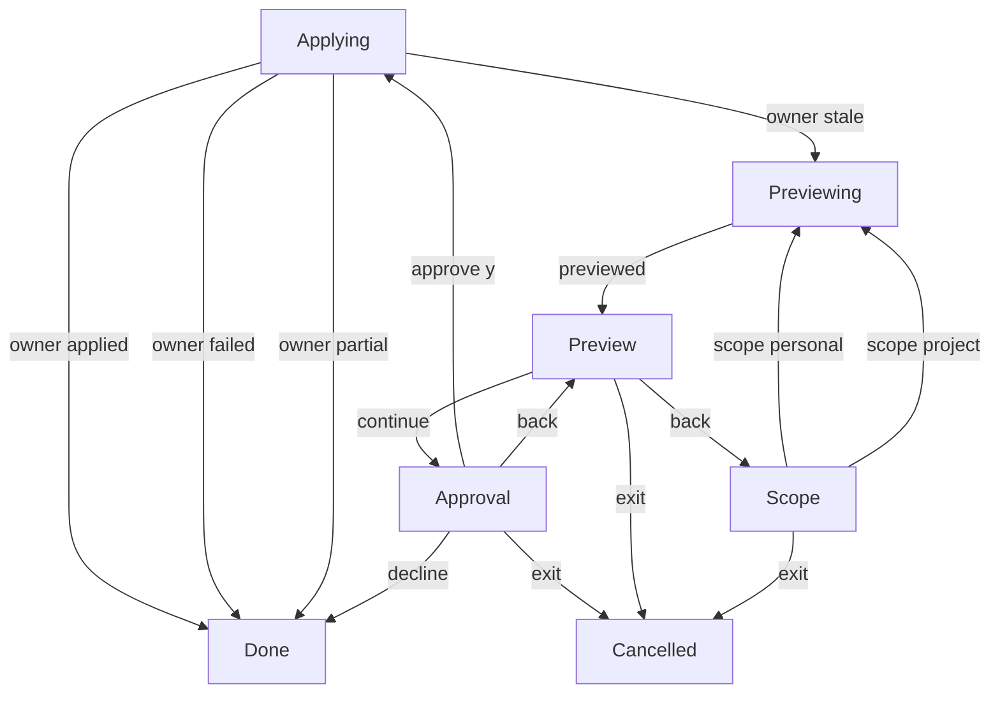

# Rules workflow replay diagram

**Purpose:** Show observed rules interaction transitions from executable workflow replays.
**Status:** Generated throwaway prototype evidence.
**Authority:** Bounded synthetic replay evidence, not a production contract or exhaustive graph.
**Expected use:** Inspect beside the rules console demo; regenerate after workflow or scenario changes.
**Lifecycle:** After #244 production integration and validation, consolidate adopted generation conventions into the production workflow documentation and architecture ADR, update inbound links, and delete this temporary artifact.

Generated by `npm run diagram:write`; checked without rewriting by `npm run diagram:check`. Replays execute [the rules workflow](rules-flow.ts) through its actual [reducer](rules-model.ts) and injected synthetic owner. Independent assertions check observed outcome, write count and script exhaustion.

## Observed transitions

Scope selection does not write. Previewing obtains an owner proposal; Applying executes an explicitly approved proposal. A stale proposal returns to preview generation and requires fresh consent. Escape equals Back where offered; at Scope it exits. EOF exits the input session. Applying waits for an observed owner result rather than implying rollback. Full-line confirmation approves only trimmed, case-insensitive **y**.

## Coverage limits

Only the declared scenario paths appear. This graph is neither exhaustive nor proof of correctness. Live focus, terminal rendering and hidden input are not modeled here. Freshness checks output consistency only. Tables retain revisions and command IDs; they exclude plans, approval digests, keys, raw owner payloads and confirmation text.

## Replay details

### create-project

Initial state: Scope, revision 0, action create; fresh synthetic owner (applied).

| Step | Phases | Event | Revision | Observed command ID |
| --- | --- | --- | --- | --- |
| 1 | Scope → Previewing | scope project | 0 → 1 | — |
| 2 | Previewing → Preview | previewed | 1 → 2 | 1 |
| 3 | Preview → Approval | continue | 2 → 3 | — |
| 4 | Approval → Applying | approve y | 3 → 4 | — |
| 5 | Applying → Done | owner applied | 4 → 5 | 4 |

### create-personal

Initial state: Scope, revision 0, action create; fresh synthetic owner (applied).

| Step | Phases | Event | Revision | Observed command ID |
| --- | --- | --- | --- | --- |
| 1 | Scope → Previewing | scope personal | 0 → 1 | — |
| 2 | Previewing → Preview | previewed | 1 → 2 | 1 |
| 3 | Preview → Approval | continue | 2 → 3 | — |
| 4 | Approval → Applying | approve y | 3 → 4 | — |
| 5 | Applying → Done | owner applied | 4 → 5 | 4 |

### connect-project

Initial state: Scope, revision 0, action connect; fresh synthetic owner (applied).

| Step | Phases | Event | Revision | Observed command ID |
| --- | --- | --- | --- | --- |
| 1 | Scope → Previewing | scope project | 0 → 1 | — |
| 2 | Previewing → Preview | previewed | 1 → 2 | 1 |
| 3 | Preview → Approval | continue | 2 → 3 | — |
| 4 | Approval → Applying | approve y | 3 → 4 | — |
| 5 | Applying → Done | owner applied | 4 → 5 | 4 |

### connect-personal

Initial state: Scope, revision 0, action connect; fresh synthetic owner (applied).

| Step | Phases | Event | Revision | Observed command ID |
| --- | --- | --- | --- | --- |
| 1 | Scope → Previewing | scope personal | 0 → 1 | — |
| 2 | Previewing → Preview | previewed | 1 → 2 | 1 |
| 3 | Preview → Approval | continue | 2 → 3 | — |
| 4 | Approval → Applying | approve y | 3 → 4 | — |
| 5 | Applying → Done | owner applied | 4 → 5 | 4 |

### enable-project

Initial state: Scope, revision 0, action enable; fresh synthetic owner (applied).

| Step | Phases | Event | Revision | Observed command ID |
| --- | --- | --- | --- | --- |
| 1 | Scope → Previewing | scope project | 0 → 1 | — |
| 2 | Previewing → Preview | previewed | 1 → 2 | 1 |
| 3 | Preview → Approval | continue | 2 → 3 | — |
| 4 | Approval → Applying | approve y | 3 → 4 | — |
| 5 | Applying → Done | owner applied | 4 → 5 | 4 |

### enable-personal

Initial state: Scope, revision 0, action enable; fresh synthetic owner (applied).

| Step | Phases | Event | Revision | Observed command ID |
| --- | --- | --- | --- | --- |
| 1 | Scope → Previewing | scope personal | 0 → 1 | — |
| 2 | Previewing → Preview | previewed | 1 → 2 | 1 |
| 3 | Preview → Approval | continue | 2 → 3 | — |
| 4 | Approval → Applying | approve y | 3 → 4 | — |
| 5 | Applying → Done | owner applied | 4 → 5 | 4 |

### disable-project

Initial state: Scope, revision 0, action disable; fresh synthetic owner (applied).

| Step | Phases | Event | Revision | Observed command ID |
| --- | --- | --- | --- | --- |
| 1 | Scope → Previewing | scope project | 0 → 1 | — |
| 2 | Previewing → Preview | previewed | 1 → 2 | 1 |
| 3 | Preview → Approval | continue | 2 → 3 | — |
| 4 | Approval → Applying | approve y | 3 → 4 | — |
| 5 | Applying → Done | owner applied | 4 → 5 | 4 |

### disable-personal

Initial state: Scope, revision 0, action disable; fresh synthetic owner (applied).

| Step | Phases | Event | Revision | Observed command ID |
| --- | --- | --- | --- | --- |
| 1 | Scope → Previewing | scope personal | 0 → 1 | — |
| 2 | Previewing → Preview | previewed | 1 → 2 | 1 |
| 3 | Preview → Approval | continue | 2 → 3 | — |
| 4 | Approval → Applying | approve y | 3 → 4 | — |
| 5 | Applying → Done | owner applied | 4 → 5 | 4 |

### default-decline

Initial state: Scope, revision 0, action create; fresh synthetic owner (applied).

| Step | Phases | Event | Revision | Observed command ID |
| --- | --- | --- | --- | --- |
| 1 | Scope → Previewing | scope project | 0 → 1 | — |
| 2 | Previewing → Preview | previewed | 1 → 2 | 1 |
| 3 | Preview → Approval | continue | 2 → 3 | — |
| 4 | Approval → Done | decline | 3 → 4 | — |

### back-and-change-scope

Initial state: Scope, revision 0, action create; fresh synthetic owner (applied).

| Step | Phases | Event | Revision | Observed command ID |
| --- | --- | --- | --- | --- |
| 1 | Scope → Previewing | scope project | 0 → 1 | — |
| 2 | Previewing → Preview | previewed | 1 → 2 | 1 |
| 3 | Preview → Scope | back | 2 → 3 | — |
| 4 | Scope → Previewing | scope personal | 3 → 4 | — |
| 5 | Previewing → Preview | previewed | 4 → 5 | 4 |
| 6 | Preview → Approval | continue | 5 → 6 | — |
| 7 | Approval → Preview | back | 6 → 7 | — |
| 8 | Preview → Approval | continue | 7 → 8 | — |
| 9 | Approval → Applying | approve y | 8 → 9 | — |
| 10 | Applying → Done | owner applied | 9 → 10 | 9 |

### changed-proposal-fresh-consent

Initial state: Scope, revision 0, action enable; fresh synthetic owner (stale).

| Step | Phases | Event | Revision | Observed command ID |
| --- | --- | --- | --- | --- |
| 1 | Scope → Previewing | scope project | 0 → 1 | — |
| 2 | Previewing → Preview | previewed | 1 → 2 | 1 |
| 3 | Preview → Approval | continue | 2 → 3 | — |
| 4 | Approval → Applying | approve y | 3 → 4 | — |
| 5 | Applying → Previewing | owner stale | 4 → 5 | 4 |
| 6 | Previewing → Preview | previewed | 5 → 6 | 5 |
| 7 | Preview → Approval | continue | 6 → 7 | — |
| 8 | Approval → Applying | approve y | 7 → 8 | — |
| 9 | Applying → Done | owner applied | 8 → 9 | 8 |

### exit-after-0-choices

Initial state: Scope, revision 0, action create; fresh synthetic owner (applied).

| Step | Phases | Event | Revision | Observed command ID |
| --- | --- | --- | --- | --- |
| 1 | Scope → Cancelled | exit | 0 → 1 | — |

### exit-after-1-choices

Initial state: Scope, revision 0, action create; fresh synthetic owner (applied).

| Step | Phases | Event | Revision | Observed command ID |
| --- | --- | --- | --- | --- |
| 1 | Scope → Previewing | scope project | 0 → 1 | — |
| 2 | Previewing → Preview | previewed | 1 → 2 | 1 |
| 3 | Preview → Cancelled | exit | 2 → 3 | — |

### exit-after-2-choices

Initial state: Scope, revision 0, action create; fresh synthetic owner (applied).

| Step | Phases | Event | Revision | Observed command ID |
| --- | --- | --- | --- | --- |
| 1 | Scope → Previewing | scope project | 0 → 1 | — |
| 2 | Previewing → Preview | previewed | 1 → 2 | 1 |
| 3 | Preview → Approval | continue | 2 → 3 | — |
| 4 | Approval → Cancelled | exit | 3 → 4 | — |

### eof-after-0-choices

Initial state: Scope, revision 0, action create; fresh synthetic owner (applied).

| Step | Phases | Event | Revision | Observed command ID |
| --- | --- | --- | --- | --- |
| 1 | Scope → Cancelled | exit | 0 → 1 | — |

### eof-after-1-choices

Initial state: Scope, revision 0, action create; fresh synthetic owner (applied).

| Step | Phases | Event | Revision | Observed command ID |
| --- | --- | --- | --- | --- |
| 1 | Scope → Previewing | scope project | 0 → 1 | — |
| 2 | Previewing → Preview | previewed | 1 → 2 | 1 |
| 3 | Preview → Cancelled | exit | 2 → 3 | — |

### eof-after-2-choices

Initial state: Scope, revision 0, action create; fresh synthetic owner (applied).

| Step | Phases | Event | Revision | Observed command ID |
| --- | --- | --- | --- | --- |
| 1 | Scope → Previewing | scope project | 0 → 1 | — |
| 2 | Previewing → Preview | previewed | 1 → 2 | 1 |
| 3 | Preview → Approval | continue | 2 → 3 | — |
| 4 | Approval → Cancelled | exit | 3 → 4 | — |

### failed

Initial state: Scope, revision 0, action disable; fresh synthetic owner (failed).

| Step | Phases | Event | Revision | Observed command ID |
| --- | --- | --- | --- | --- |
| 1 | Scope → Previewing | scope project | 0 → 1 | — |
| 2 | Previewing → Preview | previewed | 1 → 2 | 1 |
| 3 | Preview → Approval | continue | 2 → 3 | — |
| 4 | Approval → Applying | approve y | 3 → 4 | — |
| 5 | Applying → Done | owner failed | 4 → 5 | 4 |

### partial

Initial state: Scope, revision 0, action disable; fresh synthetic owner (partial).

| Step | Phases | Event | Revision | Observed command ID |
| --- | --- | --- | --- | --- |
| 1 | Scope → Previewing | scope project | 0 → 1 | — |
| 2 | Previewing → Preview | previewed | 1 → 2 | 1 |
| 3 | Preview → Approval | continue | 2 → 3 | — |
| 4 | Approval → Applying | approve y | 3 → 4 | — |
| 5 | Applying → Done | owner partial | 4 → 5 | 4 |
