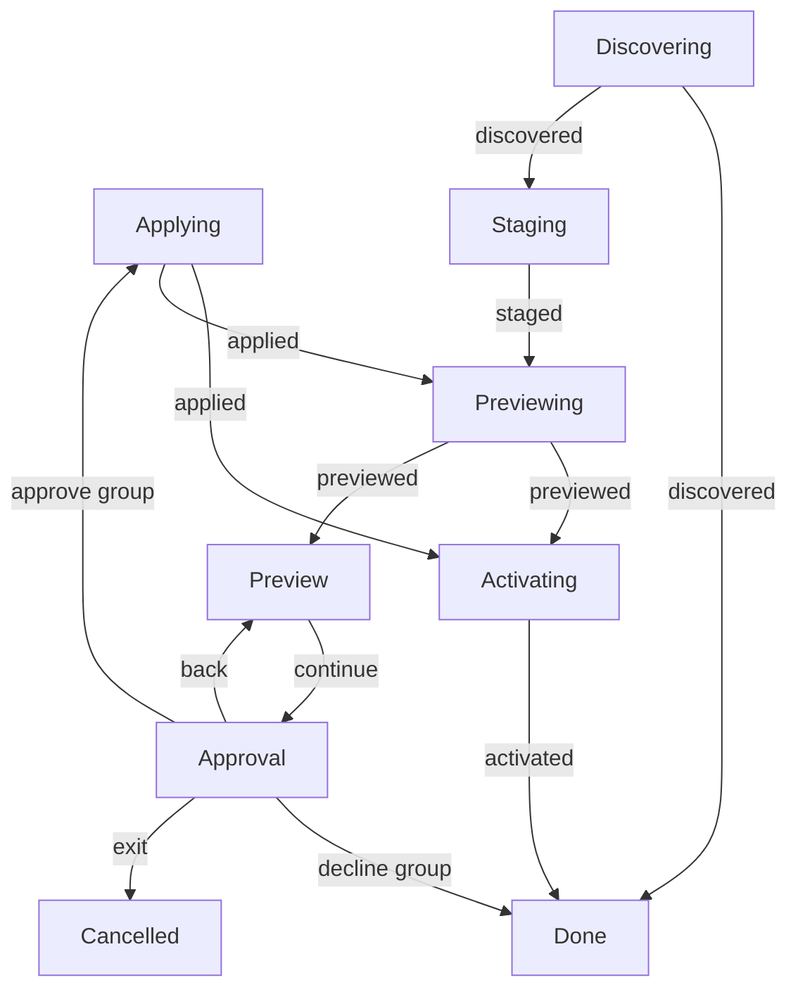

# Update workflow replay diagram

**Purpose:** Show observed update interaction transitions from named executable prototype scenarios.
**Status:** Generated prototype evidence; production owner integration is pending.
**Authority:** Bounded synthetic replay evidence, not an accepted product contract or exhaustive proof.
**Expected use:** Preview alongside the console demo and scenario assertions; explicitly regenerate after model or scenario changes.
**Lifecycle:** After #244 production integration and validation, consolidate useful decisions, generator conventions and tests into their production owners and ADR; update inbound links and delete this prototype artifact with the other #244 prototypes.

Generated by `npm run diagram:write`; checked without rewriting by `npm run diagram:check`. Source: [named scenarios](workflow-scenarios.ts) through the [actual update model/interpreter](update-flow.ts). The generator does not maintain expected edges. Independent assertions check behavior and authorized effects separately from freshness.

## Observed state-changing transitions

## Coverage and safety limits

These 14 declared replays cover observed paths only. Missing branches, rendering, focus, physical terminal behavior and arbitrary scheduling remain outside this graph. Freshness is not exhaustive coverage or correctness. Captured keys, raw owner/provider payloads, approval digests, credential generation values and input text are excluded. Tables retain only phases, bounded event labels, revisions and command IDs. Capturing/Saving are safe control phases: no key is stored in the model or event. Direct/headless CLI exceptions have no invented dialog graphs.

## Replay details

### group-updated-then-success

Fresh update model at revision 0 and a scenario-specific synthetic owner.

| Step | Phases | Event | Revision | Observed command ID |
| --- | --- | --- | --- | --- |
| 1 | Discovering → Staging | discovered | 0 → 1 | 0 |
| 2 | Staging → Previewing | staged | 1 → 2 | 1 |
| 3 | Previewing → Preview | previewed | 2 → 3 | 2 |
| 4 | Preview → Approval | continue | 3 → 4 | — |
| 5 | Approval → Applying | approve group | 4 → 5 | — |
| 6 | Applying → Activating | applied | 5 → 6 | 5 |
| 7 | Activating → Done | activated | 6 → 7 | 6 |

### group-partial-then-success

Fresh update model at revision 0 and a scenario-specific synthetic owner.

| Step | Phases | Event | Revision | Observed command ID |
| --- | --- | --- | --- | --- |
| 1 | Discovering → Staging | discovered | 0 → 1 | 0 |
| 2 | Staging → Previewing | staged | 1 → 2 | 1 |
| 3 | Previewing → Preview | previewed | 2 → 3 | 2 |
| 4 | Preview → Approval | continue | 3 → 4 | — |
| 5 | Approval → Applying | approve group | 4 → 5 | — |
| 6 | Applying → Activating | applied | 5 → 6 | 5 |
| 7 | Activating → Done | activated | 6 → 7 | 6 |

### group-failed-then-success

Fresh update model at revision 0 and a scenario-specific synthetic owner.

| Step | Phases | Event | Revision | Observed command ID |
| --- | --- | --- | --- | --- |
| 1 | Discovering → Staging | discovered | 0 → 1 | 0 |
| 2 | Staging → Previewing | staged | 1 → 2 | 1 |
| 3 | Previewing → Preview | previewed | 2 → 3 | 2 |
| 4 | Preview → Approval | continue | 3 → 4 | — |
| 5 | Approval → Applying | approve group | 4 → 5 | — |
| 6 | Applying → Activating | applied | 5 → 6 | 5 |
| 7 | Activating → Done | activated | 6 → 7 | 6 |

### decline-empty

Fresh update model at revision 0 and a scenario-specific synthetic owner.

| Step | Phases | Event | Revision | Observed command ID |
| --- | --- | --- | --- | --- |
| 1 | Discovering → Staging | discovered | 0 → 1 | 0 |
| 2 | Staging → Previewing | staged | 1 → 2 | 1 |
| 3 | Previewing → Preview | previewed | 2 → 3 | 2 |
| 4 | Preview → Approval | continue | 3 → 4 | — |
| 5 | Approval → Done | decline group | 4 → 5 | — |

### decline-yes

Fresh update model at revision 0 and a scenario-specific synthetic owner.

| Step | Phases | Event | Revision | Observed command ID |
| --- | --- | --- | --- | --- |
| 1 | Discovering → Staging | discovered | 0 → 1 | 0 |
| 2 | Staging → Previewing | staged | 1 → 2 | 1 |
| 3 | Previewing → Preview | previewed | 2 → 3 | 2 |
| 4 | Preview → Approval | continue | 3 → 4 | — |
| 5 | Approval → Done | decline group | 4 → 5 | — |

### decline-n

Fresh update model at revision 0 and a scenario-specific synthetic owner.

| Step | Phases | Event | Revision | Observed command ID |
| --- | --- | --- | --- | --- |
| 1 | Discovering → Staging | discovered | 0 → 1 | 0 |
| 2 | Staging → Previewing | staged | 1 → 2 | 1 |
| 3 | Previewing → Preview | previewed | 2 → 3 | 2 |
| 4 | Preview → Approval | continue | 3 → 4 | — |
| 5 | Approval → Done | decline group | 4 → 5 | — |

### no-registration

Fresh update model at revision 0 and a scenario-specific synthetic owner.

| Step | Phases | Event | Revision | Observed command ID |
| --- | --- | --- | --- | --- |
| 1 | Discovering → Done | discovered | 0 → 1 | 0 |

### all-current

Fresh update model at revision 0 and a scenario-specific synthetic owner.

| Step | Phases | Event | Revision | Observed command ID |
| --- | --- | --- | --- | --- |
| 1 | Discovering → Staging | discovered | 0 → 1 | 0 |
| 2 | Staging → Previewing | staged | 1 → 2 | 1 |
| 3 | Previewing → Activating | previewed | 2 → 3 | 2 |
| 4 | Activating → Done | activated | 3 → 4 | 3 |

### current-plus-declined

Fresh update model at revision 0 and a scenario-specific synthetic owner.

| Step | Phases | Event | Revision | Observed command ID |
| --- | --- | --- | --- | --- |
| 1 | Discovering → Staging | discovered | 0 → 1 | 0 |
| 2 | Staging → Previewing | staged | 1 → 2 | 1 |
| 3 | Previewing → Preview | previewed | 2 → 3 | 2 |
| 4 | Preview → Approval | continue | 3 → 4 | — |
| 5 | Approval → Done | decline group | 4 → 5 | — |

### changed-group-reapprove

Fresh update model at revision 0 and a scenario-specific synthetic owner.

| Step | Phases | Event | Revision | Observed command ID |
| --- | --- | --- | --- | --- |
| 1 | Discovering → Staging | discovered | 0 → 1 | 0 |
| 2 | Staging → Previewing | staged | 1 → 2 | 1 |
| 3 | Previewing → Preview | previewed | 2 → 3 | 2 |
| 4 | Preview → Approval | continue | 3 → 4 | — |
| 5 | Approval → Applying | approve group | 4 → 5 | — |
| 6 | Applying → Previewing | applied | 5 → 6 | 5 |
| 7 | Previewing → Preview | previewed | 6 → 7 | 6 |
| 8 | Preview → Approval | continue | 7 → 8 | — |
| 9 | Approval → Applying | approve group | 8 → 9 | — |
| 10 | Applying → Activating | applied | 9 → 10 | 9 |
| 11 | Activating → Done | activated | 10 → 11 | 10 |

### activation-failure

Fresh update model at revision 0 and a scenario-specific synthetic owner.

| Step | Phases | Event | Revision | Observed command ID |
| --- | --- | --- | --- | --- |
| 1 | Discovering → Staging | discovered | 0 → 1 | 0 |
| 2 | Staging → Previewing | staged | 1 → 2 | 1 |
| 3 | Previewing → Preview | previewed | 2 → 3 | 2 |
| 4 | Preview → Approval | continue | 3 → 4 | — |
| 5 | Approval → Applying | approve group | 4 → 5 | — |
| 6 | Applying → Activating | applied | 5 → 6 | 5 |
| 7 | Activating → Done | activated | 6 → 7 | 6 |

### exit

Fresh update model at revision 0 and a scenario-specific synthetic owner.

| Step | Phases | Event | Revision | Observed command ID |
| --- | --- | --- | --- | --- |
| 1 | Discovering → Staging | discovered | 0 → 1 | 0 |
| 2 | Staging → Previewing | staged | 1 → 2 | 1 |
| 3 | Previewing → Preview | previewed | 2 → 3 | 2 |
| 4 | Preview → Approval | continue | 3 → 4 | — |
| 5 | Approval → Cancelled | exit | 4 → 5 | — |

### eof

Fresh update model at revision 0 and a scenario-specific synthetic owner.

| Step | Phases | Event | Revision | Observed command ID |
| --- | --- | --- | --- | --- |
| 1 | Discovering → Staging | discovered | 0 → 1 | 0 |
| 2 | Staging → Previewing | staged | 1 → 2 | 1 |
| 3 | Previewing → Preview | previewed | 2 → 3 | 2 |
| 4 | Preview → Approval | continue | 3 → 4 | — |
| 5 | Approval → Cancelled | exit | 4 → 5 | — |

### back-from-approval

Fresh update model at revision 0 and a scenario-specific synthetic owner.

| Step | Phases | Event | Revision | Observed command ID |
| --- | --- | --- | --- | --- |
| 1 | Discovering → Staging | discovered | 0 → 1 | 0 |
| 2 | Staging → Previewing | staged | 1 → 2 | 1 |
| 3 | Previewing → Preview | previewed | 2 → 3 | 2 |
| 4 | Preview → Approval | continue | 3 → 4 | — |
| 5 | Approval → Preview | back | 4 → 5 | — |
| 6 | Preview → Approval | continue | 5 → 6 | — |
| 7 | Approval → Applying | approve group | 6 → 7 | — |
| 8 | Applying → Activating | applied | 7 → 8 | 7 |
| 9 | Activating → Done | activated | 8 → 9 | 8 |
